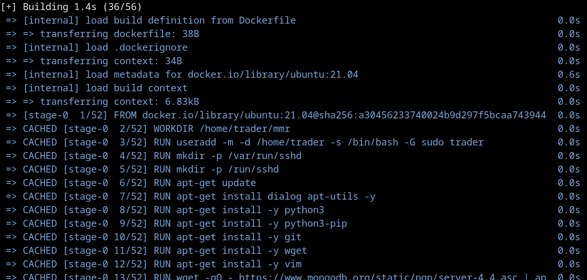
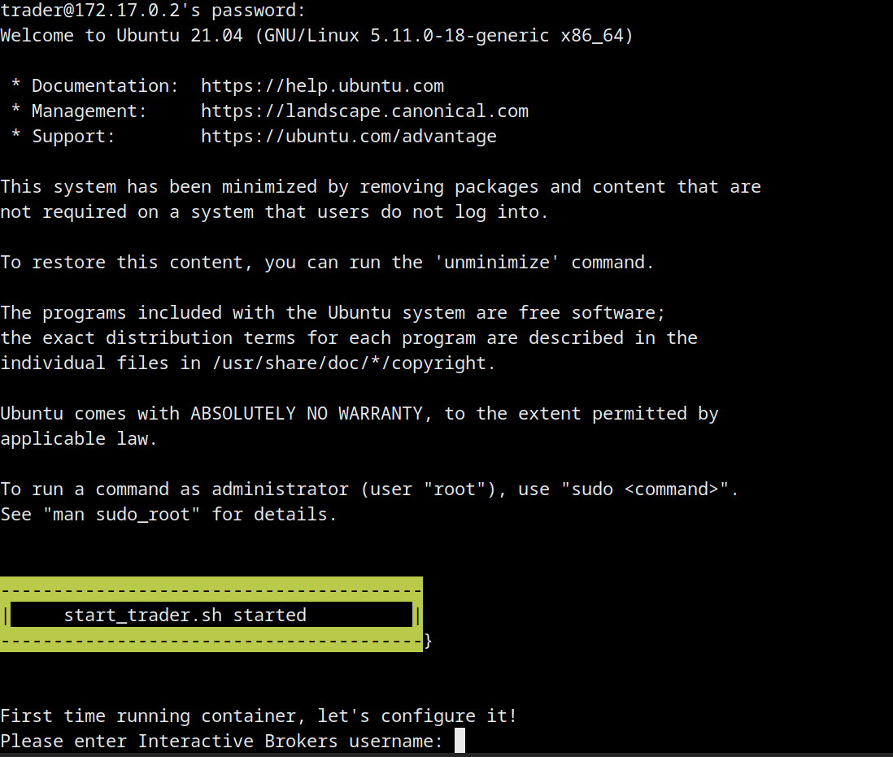
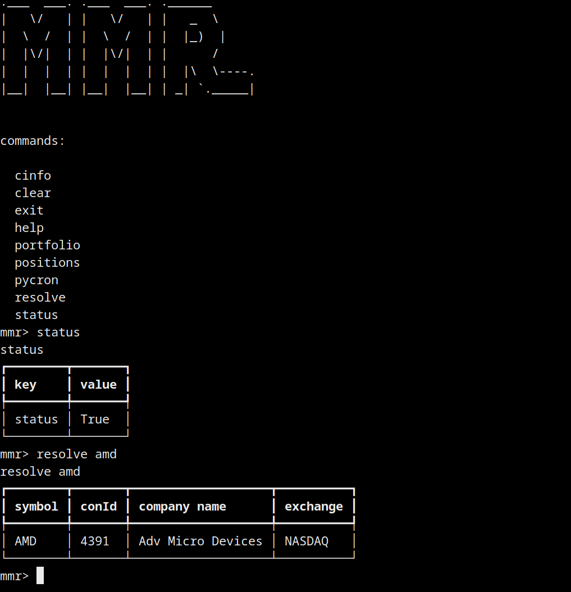
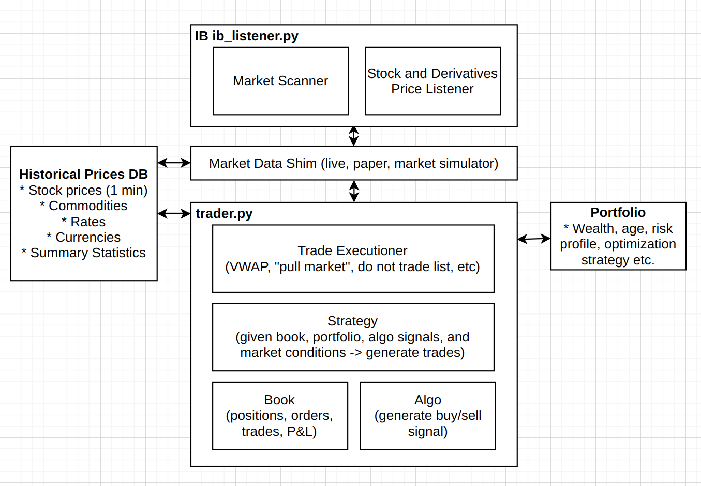

# Make Me Rich! 

Python based algorithmic trading platform similar to QuantRocket (www.quantrocket.com) and others. It uses the Interactive Brokers brokerage API's to route and execute its trades.

Features include:

* [aioreactive](https://github.com/dbrattli/aioreactive) for asyncio pipelining and programming abstraction, and [vectorbt](https://github.com/polakowo/vectorbt) for algorithm programmability and backtesting.
* Batch download of instrument data from [Interactive Brokers](https://www.interactivebrokers.com/en/home.php) and Polygon.io
* [Arctic Timeseries and Tick Store](https://github.com/man-group/arctic) for tick data storage
* and more...

### Status

- [x] Basic technical architecture completed (asyncio, caching, db layer, backtesting, historical data collection, messaging etc)
- [x] Polygon.io historical data collection
- [x] Interactive brokers historical data collection
- [x] Login; logoff; get positions; get portfolio;
- [x] Subscribe to bars, subscribe to ticks
- [ ] Place, cancel, update orders (partially working)
- [ ] Backtesting
- [ ] Risk analysis
- [ ] Add/remove strategies
- [ ] ... and everything else.

## Installation

### Docker Installation (easiest)

The simplest way to install and run MMR trader is via Docker. It will use an Ubuntu 21.04 image, install Python 3.9, install all requirements, and automatically install the Interactive Brokers Trader Workstation.

```
$ git clone https://github.com/9600dev/mmr.git
$ cd mmr/
$ scripts/build_docker.sh
```



This script will build the docker image and run a container instance for you.

Once it's built and running, ssh into the container to continue the installation and configuration of Trader Workstation:

```
>> build complete
>> ssh into container via trader:trader@172.17.0.2

$ ssh trader@172.17.0.2
```



Enter your Trader Workstation username and password. The script will proceed to automatically install the latest Trader Workstation version.

After this has completed, it will start a tmux session with two commands:

* "pycron" (MMR's process spawner and scheduler) which handles the process scheduling, maintenance and uptime of ArcticDB, Redis, X Windows, and Trader Workstation, ready for automatic trading.
* "cli" which is command line interface to interact with the trading system (check portfolio, check systems, manually create orders etc). You can manually call this using ```python3 cli.py```.



You can VNC into the Docker container also, which will allow you to interact with the running instance of TWS workstation.

### Manual Installation

If you want to YOLO the install, and you're on Ubuntu or a derivative, run the ```native_install.sh``` script, otherwise:

* Clone this repository into /home/trader/mmr directory
* Create a user 'trader' (or chown a new /home/trader directory)
* Install [Trader Workstation](https://download2.interactivebrokers.com/installers/tws/latest-standalone/tws-latest-standalone-linux-x64.sh) >= version 985
* Install IBC: https://github.com/IbcAlpha/IBC into /home/trader/ibc
* Copy ``configs/config.ini`` and ``configs/twstart.sh`` into /home/trader/ibc directory. Adjust both of those files to reflect the TWS version you installed.
* Make sure ~/ibc/logs and ~/mmr/logs directories are created
* Install MongoDB: https://docs.mongodb.com/manual/installation/
* Install Arctic Database (Mongo wrapper basically): https://github.com/man-group/arctic
* Install Python 3.9
* Install Pip and then ```pip3 install -r requirements.txt```
* Install Redis via ```sudo apt install redis-server```
* Start pycron:
 	* ```cd /home/trader/mmr/pycron```
 	* ```python3 pycron.py ../configs/pycron.yaml```


## Other Stuff

TODO:// explain how all this stuff works.

* ```trader/batch``` directory has the batch services, which allow you to queue up and download historical data from IB or Polygon.io.
  * ```python3 history_queuer.py --contracts ../../data/ib_symbols_nyse_nasdaq.csv --prev_days 30``` download 30 days worth of 1 minute data for all stocks listed in ib_symbols_nyse_nasdaq.csv.
  * This should automatically queue Price History requests for stocks listed in csv using [RQ Python](https://python-rq.org/). There is an ``rq`` worker that will run automatically, as it's already running and listening from PyCron.
  * ```python3 polygon_queuer.py --contracts ../../data/ib_symbols_nyse_nasdaq.csv``` does the same price history download, but using polygon.io.
  * The ```*_batch.py``` files contain the classes that are invoked from ```rq```
* ```trader/scripts``` directory contains a bunch of helpers to grab the complete lists of symbols from various exchanges around the world; contains symbol -> interactive broker 'conId' resolution (```ib_resolve.py```) and more.
* ```trader/scripts/trader_check.py``` will do a bunch of system checks to make sure all services are up, and interactive brokers is responding
* ```trader/listeners/ib_listener.py``` and ```trader/listeners/ibrx.py``` is the RxPy concurrency wrapper around the Interactive Brokers API. It is what you program against.
* ```pycron/pycron.py```is the workhorse for process scheduling. It makes sure all services and processes are continuously running (restarting if they're not) and checks for dependencies. It will also start, stop and restart services on a crontab like schedule.
* Want a complete list of symbols from NASDAQ and NYSE?
  * ```python3 scripts/eoddata_scraper.py --exchange NASDAQ --csv_output_file NASDAQ.csv```
  * ```python3 scripts/eoddata_scraper.py --exchange NYSE --csv_output_file NYSE.csv```
  * ```cat NASDAQ.CSV NYSE.csv > complete.csv```
  * Add the Interactive Brokers 'conId' column:
  * ```python3 ib_resolve.py --csv_file complete.csv --csv_output_file ib_symbols_nyse_nasdaq.csv```

# Direction

MMR trading platform should be able to scale from a couple of trades per month, to many trades per minute:


Therefore, needs to support a wide range of strategy requirements:

* [low frequency] Risk analysis of portfolio compared to market conditions: re-balancing. Tax implications etc.
* [medium frequency] Trade strategies that span multiple days/weeks: mean reversion over time.
* [semi-high frequency] Momentum trades spanning minutes, quick exits from risky positions, market making (selling buying calls and puts) etc.
* Non-goal is sub-second high frequency trading.

## Block architecture



Some of this stuff is built, a lot of it isn't. Some general product requirements:

* Live market feeds for prices etc are saved and "re-playable" via simulation.
* Historical data can be use to "replay" previous days/months/years of trading (i.e. use bid, ask, price, last_price, volume, etc to simulate the IB market feed)
* Two dominant data-structures the platform is based on:
  * DataFrames that represent prices, which can be 'windowed' over time.
  * Reactive Extensions (or equivalent) that allows

### Pycron ```pycron/pycron.py```

Pycron deals with scheduling, starting, stopping and restarting processes, services, and tasks. It features:

* Sorting out the starting of process dependencies.
* Restarting processes that crash
* Scheduling the start/stop/restart of jobs for specific times/days
* Runs periodic health checks
* Has a small tornado based webservice that allows for remote control of processes


# Backlog

* timezonify should move everything that's deailing with internal timezones to timezone.utc
* Move timezoneify logic to the SecurityDefinition class, so that timezone updates to dt.datetime's are local to the security/market
* ```listener_helpers.py``` and ```helpers.py``` need to be consolidated.
* The batch queuing stuff is a bit wonky (there's a subclass there ```queuer.py``` but it's doesn't have the right abstraction). Given batch data downloads is going to be important, should probably clean all this up.
* aioreactive performance needs to be analyzed. If we're going to have a full replay system (i.e. running historical data through an Interactive Brokers simulator) then RxPy needs to be super fast to do back-testing efficiently.
* aioreactive and vectorbt interplay needs to be looked at also. RxPy has great window/batching API's (it's join calculus could be used for incoming streams of data), but pandas also has a pandas-streaming library that we should look at also.
* ```ib_listener.py``` is incomplete, and definitely lacks testing. Should be super rigorous on this, as it's the foundation for all trade and price routing.
* There's no testing framework setup, and no test coverage. Setup test framework. Add tests.
* For all the command line tools, we have switches that are 'defaulted' to 127.0.0.1 etc, but we also have ```configs/trader.yaml``` configuration file. Reconcile these two. We probably need some sort of dependency injection/configuration injection style thing, I dunno.

# Scratch notes

* [Market in-and-out - good screener](https://www.marketinout.com/correlation/stock-correlation.php?symbol=MSFT&period=30&sorting=cor&desc=1)
* [Stock Returns forecasting using Bayesian methods](https://github.com/yxue02/Stock-returns-forecasting-using-Bayesian-methods)
* [Hacker News discussion on the harmonic paper](https://news.ycombinator.com/item?id=19214650)
* [Portfolio Visualizer](https://www.portfoliovisualizer.com/backtest-asset-class-allocation?s=y&mode=1&timePeriod=4&startYear=1972&firstMonth=1&endYear=2020&lastMonth=12&calendarAligned=true&includeYTD=false&initialAmount=10000&annualOperation=0&annualAdjustment=0&inflationAdjusted=true&annualPercentage=0.0&frequency=4&rebalanceType=1&absoluteDeviation=5.0&relativeDeviation=25.0&portfolioNames=true&portfolioName1=Harry+Browne+Permanent+Portfolio&portfolioName2=Ray+Dalio+All+Weather&portfolioName3=TIPS&asset1=TotalStockMarket&allocation1_1=25&allocation1_2=30&asset2=LongTreasury&allocation2_1=25&allocation2_2=40&asset3=TreasuryBills&allocation3_1=25&asset4=Gold&allocation4_1=25&allocation4_2=7.50&asset5=IntermediateTreasury&allocation5_2=15&asset6=Commodities&allocation6_2=7.50&asset7=TIPS&allocation7_3=100&fbclid=IwAR11LDUb5XkQ2Er4LdHkT21wglIBpmogVHOCFjUyhTe-wWOqIBgP7nBdKqA)
* [Why this is unlike the great depression (better and worse)](https://www.lynalden.com/great-depression/?fbclid=IwAR1SFz6bnvHTN2VxVCXMRPeSh5-WzE4uWEe2TARQ7LYdFw7kA9116IGWlJY)
* [Ultimate Guide to Safe Withdrawal Rates](https://earlyretirementnow.com/2016/12/07/the-ultimate-guide-to-safe-withdrawal-rates-part-1-intro/?fbclid=IwAR2ioz9FhQysXiQHAgrbmw_7qN8RrU5JDsUWgylpHWPuyRSzpKAFl4sVoO0)
* [Vangaurd Nest Egg Calculator](https://retirementplans.vanguard.com/VGApp/pe/pubeducation/calculators/RetirementNestEggCalc.jsf)
* [Minafi.com](https://minafi.com/interactive-guide-early-retirement-financial-independence#part-2)
* [Financial Mentor](https://financialmentor.com/calculator/best-retirement-calculator)

### Links

* [Trader's Notes -- TWS API notes](https://dimon.ca/dmitrys-tws-api-faq/)
* [Alpha Architect - White Papers](https://alphaarchitect.com/alpha-architect-white-papers/)
* [Trading Economics - good flat, simple data site](https://tradingeconomics.com/)
* [Spectre - GPU based backtester](https://github.com/Heerozh/spectre)
* [Tradytics - AI stock tool](https://tradytics.com/overall-market)
* [Redtide - yahoo finance scraper](https://github.com/qks1lver/redtide)
* [Financial data of 4400+ public companies](https://www.kaggle.com/qks1lver/financial-data-of-4400-public-companies/data)
* [Finviz - Market Heat map](https://finviz.com/map.ashx)
* [Quantpedia - Historical Data](https://quantpedia.com/links-tools/?category=historical-data)
* [Reddit - algo trading wiki](https://www.reddit.com/r/algotrading/wiki/index)
* [Historical Options chains](http://base2.optionsdatamine.com/page.php?section=PAGE1_index)


### The same old boom notes: [link](https://investoramnesia.com/2020/09/13/the-same-old-boom/)

* One of the main takeaways is that even with greater access to information through technological innovations (in this case the ticker, but could be Robinhood, etc. today), uninformed traders will actually demonstrate increased herding behavior and pile into the same stocks despite having more information on a broader pool of stocks to select from. Feels similar to the recent speculative boom by retail investors that seems to have focused heavily on Tesla and Apple.
* ‘Each new dollar invested into passive index funds must purchase the securities in the benchmark index. These purchases exert an inexorable influence on the underlying securities. Per Sharpe’s own work, these are not passive investors – they are mindless systematic active investors with zero interest in the fundamentals of the securities they purchase.
* ‘How does access to information affect price efficiency? We address this question by studying the stock ticker; a device that disseminated price changes to brokerage offices with a ticker subscription. We find that an increased number of ticker subscriptions in a state strengthened the return continuation and return co-movement of firms headquartered in the state. Therefore, the increased dissemination of price changes appears to have decreased price efficiency by increasing uninformed trend chasing. Our results challenge the assumption that greater access to information improves price efficiency.‘


* The main takeaway from this article is that Value underperforms in the Installation Phase, but outperforms after the Turning Point, as the cycle enters the Deployment Phase.


* (https://github.com/hmmlearn/hmmlearn)
* (https://quantstrattrader.wordpress.com/)
* (https://www.reddit.com/r/Python/comments/7thmfp/best_framework_for_systematic_trading/)
* (https://www.quantstart.com/articles/Quantitative-Finance-Reading-List/)
* [Trading Calendar](https://github.com/Emsu/prophet/blob/master/prophet/utils/tradingcalendar.py)
* (https://github.com/benjaminmgross/visualize-wealth)
* (https://www.reddit.com/r/algotrading/comments/jye0bj/literature/)
* (https://github.com/mrjbq7/ta-lib)
* (https://github.com/hudson-and-thames/mlfinlab)
* (https://github.com/pyro-ppl/numpyro)
* [A better pickle](https://github.com/uqfoundation/dill)

## Trading Systems
* (https://github.com/robcarver17/pysystemtrade/blob/master/docs/introduction.md)
* (http://pmorissette.github.io/bt/index.html#what-is-bt)
* (https://qtpylib.io/docs/latest/algo.html)
* (https://github.com/polakowo/vectorbt)
* (https://github.com/michaelchu/optopsy)
* (https://github.com/wilsonfreitas/awesome-quant)
* (https://github.com/twopirllc/pandas-ta)
* (https://github.com/jankrepl/deepdow)
* (https://github.com/quantopian/trading_calendars)
* (https://github.com/litl/backoff)

## Interesting Information

* [Thread on how clearing houses work, and what happened in the RH GME debarcle](https://twitter.com/compound248/status/1355274739351248898)
* [vectorbt blog - Stop Loss, Trailing Stop or Take Profit?](https://polakowo.medium.com/)
* [random notes about tws](https://dimon.ca/dmitrys-tws-api-faq/)

## Books

* [Statistical Rethinking - comes with examples in Pyro](https://xcelab.net/rm/statistical-rethinking/)


## License

This work is [fair-code](http://faircode.io/) distributed under [Apache 2.0 with Commons Clause](LICENSE.md) license.
The source code is open and everyone (individuals and organizations) can use it for free.
However, it is not allowed to sell products and services that are mostly just this software.

If you have any questions about this or want to apply for a license exception, please contact the author.

Installing optional dependencies may be subject to a more restrictive license.

## Disclaimer

This software is for educational purposes only. Do not risk money which you are afraid to lose.
USE THE SOFTWARE AT YOUR OWN RISK. THE AUTHORS AND ALL AFFILIATES ASSUME NO RESPONSIBILITY FOR YOUR TRADING RESULTS.
