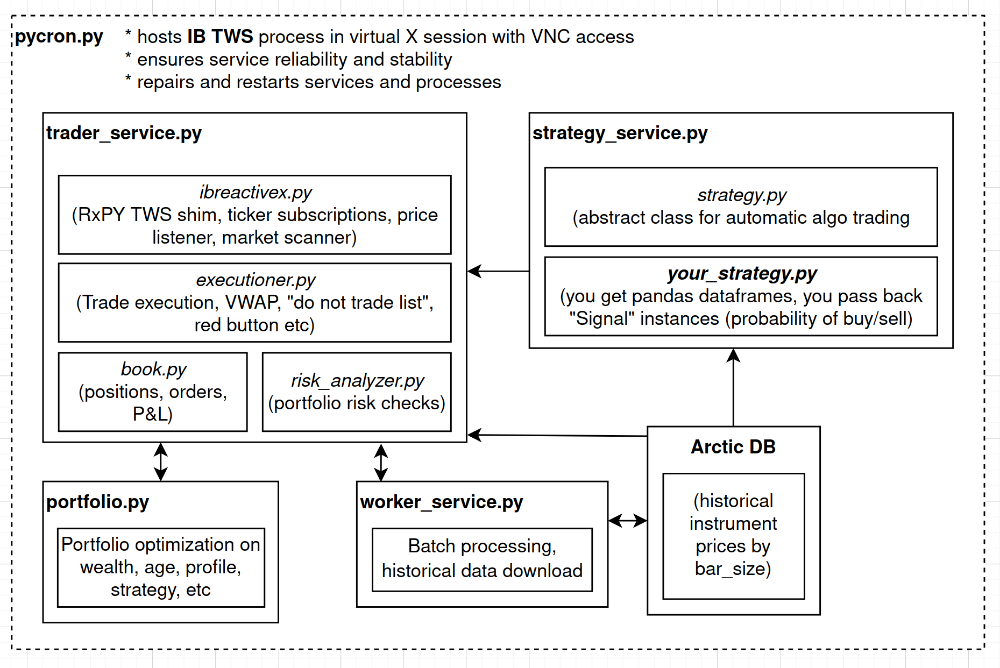

# Make Me Rich!


Python based algorithmic trading platform for [Interactive Brokers](https://interactivebrokers.com), similar to [QuantRocket](https://www.quantrocket.com) and others. It uses the Interactive Brokers brokerage API's to download historical data, and route/execute its trades.

You can use MMR in three ways:

1. Complete automated and algorithmic trading: MMR will subscribe to instrument ticks, pipe them to your algo, and you provide the signal for automatic trading.
2. Fully interactive terminal prompt: get quotes, create, cancel, change orders etc from a live terminal prompt.
2. Command line trading: get quotes, create, cancel and change orders etc, all from the Windows, MacOS or Linux command line.

MMR hosts the Interactive Brokers Trader Workstation instance, maintains connection, ensures consistency and reliabilty between your Interactive Brokers account and your local trading book. It's opinionated about the programming abstractions you should use to program your algos, but will meet you at the level of abstraction you want.

It relies on:

* [RxPy 4.0](https://github.com/ReactiveX/RxPY) for asyncio pipelining and programming abstraction, and [vectorbt](https://github.com/polakowo/vectorbt) for algorithm programmability and backtesting.
* Batch download of historical instrument data from [Interactive Brokers](https://www.interactivebrokers.com/en/home.php) and [Polygon.io](https://www.polygon.io).
* [Arctic Timeseries and Tick Store](https://github.com/man-group/arctic) for tick data storage and super-fast retrieval.
* [erdewit's ib_insync API](https://github.com/erdewit/ib_insync). A sane sync/asyncio wrapper around the TWS API.
* No fancy Web x.x technologies, just simple and easily extended Python services.
* Docker build and deploy on Debian 11.5 + Python 3.9.5.
* and more...

### Status

- [x] Basic technical architecture completed (asyncio, caching, db layer, backtesting, historical data collection, messaging etc)
- [x] Polygon.io historical data collection
- [x] Interactive brokers historical data collection
- [x] Login; logoff; get positions; get portfolio;
- [x] Subscribe to bars, subscribe to ticks
- [x] Place, cancel, update orders for all Interactive Brokers instruments
- [x] Stop loss, trailing stop loss
- [ ] Backtesting
- [ ] Algorithmic Strategy API and extensibility hooks (started)
- [ ] Strategy and portfolio risk analysis (started)
- [ ] Add/remove strategies
- [ ] Hyperparameter search on strategies

There is still about 2-3 months of work left before MMR is 'shippable'. If you want to help speed that up, send me a message.

## Want to Learn About Finance?

[Follow along here](docs/finance_notes/INDEX.md) as I take notes from books and web resources. Macro, micro, market structure, accounting, pricing, market making and trading systems.

I lean heavily on the following books for the design of this trading system, and my own algorithmic trading:

[](https://www.amazon.com/Systematic-Trading-designing-trading-investing/dp/0857194453)
[](https://www.amazon.com/Advances-Financial-Machine-Learning-Marcos/dp/1119482089)

## Installation

### Docker Installation

The simplest way to install and run MMR trader is via Docker. It will use a Debian 11.5 image, install Python 3.9.5, install all requirements, and automatically install the latest version of Interactive Brokers Trader Workstation.

```
$ git clone https://github.com/9600dev/mmr.git
$ cd mmr/
$ ./docker.sh --go     # builds, deploys, and runs the docker container
```

or:

```
$ ./docker.sh --clean  # cleans images and containers
$ ./docker.sh --build  # builds image
$ ./docker.sh --run    # deploys container in docker, runs MMR

and then:

$ ./docker.sh --sync   # to sync local code changes to running container

```


The script will build the docker image and run a container instance for you.

Once it's built and running, ssh into the container to continue the installation and configuration of Trader Workstation:

```
>> 0a97a73dcbccdeadd6b7f9abee1a945dfb1d909b78255a72f97e156063ac4bf1
>>
>> ip address: 172.17.0.2
>> ssh into container via trader@localhost -p 2222, password 'trader'

$ ssh trader@localhost -p 2222
```


Enter your Trader Workstation username and password. The script will proceed to automatically install the latest Trader Workstation version.

After this has completed, it will call a script `start_trader.sh` in the MMR root directory, which starts a [tmux](https://github.com/tmux/tmux/wiki) session with five commands:

* `pycron` (MMR's process spawner and scheduler) which handles the process scheduling, maintenance and uptime of the MMR trading runtime, ArcticDB, Redis, X Windows, and Trader Workstation, ready for automatic trading. You can manually call this by: ```python3 pycron/pycron.py --config ./configs/pycron.yaml```
* `cli` which is command line interface to interact with the trading system (check portfolio, check systems, manually create orders etc). You can manually call this using ```python3 cli.py```.
* `info` a simple realtime dashboard that observes the MMR runtime. Displays positions, portfolio, and strategy logs.
* `trader_service_log` displays the trader service log real time (see below for information on this service).
* `strategy_service_log` displays the trader service log real time.


When starting MMR for the first time, there are a couple of things you should do:

#### Checking MMR status:

* ```status```


#### Bootstrapping the symbol universes

After ensuring everything is connected and functioning, you should bootstrap the population of the "symbol universe". This is MMR's cache of most of Interactive Brokers tradeable instruments, mapping symbol to IB contract ID (i.e. AMD -> 4931).

* ```universes bootstrap```


This command will grab the symbols for NYSE, NASDAQ, ASX, LSE, CFE, GLOBEX, NYMEX, CBOE, NYBOT, and ICEUS and stash them in their respective "universes". The command typically takes a good couple of hours to complete.

A Universe (like "NASDAQ") is a collection of symbols and their respective Interactive Brokers contract id's to which you can apply your trading algo's to. You can resolve a symbol to universe and contract id via:

* ```resolve --symbol AMD```


From here you're good to go: either using the `cli` to push manual trades to IB, or by implementing an algo, through extending the `Strategy` abstract class. An example of a strategy implementation can be found [here](https://github.com/9600dev/mmr/blob/master/strategies/smi_crossover.py). There's still a lot to do here, and the implementation of the strategy runtime changes often.

### Manual Installation

See [docs/MANUAL_INSTALL.md](docs/MANUAL_INSTALL.md)

### Trading Manually from the Command Line

There are two ways to perform trades and inspect the MMR runtime manually: from the command line, or through the CLI helper.

To fire up the CLI helper, type:

* ```python3 cli.py```


This gives you a range of options to interact with the MMR runtime: inspect orders, logs, trades etc, and manually submit trades from the CLI itself:

* ```mmr> trade --symbol AMD --buy --limit 60.00 --amount 100.0```

While most command inputs take the string symbol (in this case "AMD") its best to use the unique contract identifier that Interactive Brokers supplies, and you can do this via the ```mmr> resolve``` command:


Trading from your command line interface of choice is also supported:

* ```/home/trader/mmr $] python3 cli.py trade --symbol AMD --buy --market --amount 100.0```

There's also a terminal based dashboard to quickly inspect the runtime, orders, algos and prices [TODO: this is under active development]:

* ```python3 info.py```


### cli.py commands

You can choose to use the REPL (read eval print loop) via ```python3 cli.py``` or by invoking the command directly from the command line, i.e. ```/home/trader/mmr $] python3 cli.py trade --symbol AMD --buy --market --amount 100.0```

| Command       | Sub Commands | Help |
| :-------------| ----:|:------|
| book          | cancel orders trades | shows the current order book |
| clear         | | clears the screen |
| company-info  | | shows company financials when connected to polygon.io [in progress] |
| exit          || exits the cli |
| history       | bar-sizes get-symbol-history-ib get-universe-history-ib jobs read security summary | retrieves historical price data from IB or Polygon.io (in progress) for a given security or universe. Use "history bar-sizes" for a list of bar sizes supported |
| option        | plot | gets option data for a given date and plots a histogram of future price |
| portfolio     | | shows the current portfolio |
| positions     | | shows current positions |
| pycron        | | shows pycron status |
| reconnect     | | reconnects to Interactive Brokers TWS |
| resolve       | | resolves a symbol (i.e. AMD) to a universe and IB connection ID |
| snapshot      | | gets a price snapshot (delayed or realtime) for a given symbol |
| status        | | checks the status of all services and systems |
| strategy      | enable list | lists, enables and disables loaded strategies |
| subscribe     | list listen portfolio start universe | subscribes to tick data for a given symbol or universe, optionally displays tick changes to console |
| trade         | | creates buy and sell orders (market, limit) with or without stop loss |
| universes     | add-to-universe bootstrap create destroy get list | creates and deletes universes; adds securities to a given universe; bootstraps universes from IB |

## Implementing an Automated Algorithm/Strategy

TODO:// there are many different levels of abstraction that MMR can work at, explain all of them.

This is all still in flux, but you can take a look at the source code to get a sense of the different algo implementation abstractions:

* Most flexible, most difficult: Using [trader/listeners/ibreactive.py](https://github.com/9600dev/mmr/blob/master/trader/listeners/ibreactive.py) instead of ib_insync. This is essentially a RxPY wrapper around the ib_insync library to move ib_insync from event driven to reactive/stream driven, which makes real-time algo coding easier.
* Less flexible: Adding/extending [trader_runtime.py](https://github.com/9600dev/mmr/blob/master/trader/trading/trading_runtime.py). The trader_service.py service hosts trading_runtime, which spins up a ibreactive.py connection to TWS, maintains trade and book state, and enables real-time streaming tick data subscription handling. It also a clean simple library to interact with the Tick Data database, risk analysis, financial math apis and more.
* Less flexible, but preferred method: extending [trader/trading/strategy.py](https://github.com/9600dev/mmr/blob/master/trader/trading/strategy.py). Build your own strategy by exending this base class. It will be hosted by the [strategy_service.py](https://github.com/9600dev/mmr/blob/master/strategy_service.py) service, a separate process that enables tick subscriptons and routes trades through the trader_service.py service. strategy_service.py will also handle backfilling historical data, ensuring reliability of order routing, and running risk safety checks.


## Debugging

You can VNC into the Docker container which will allow you to interact with the running instance of TWS workstation. Screenshot below shows [TigerVNC](https://tigervnc.org/) viewing a stalled TWS instance waiting for authentication:


All services log debug, info, critical and warn to the following log files:

* ```logs/trader.log``` for most module level debug output
* ```logs/error.log``` for critical/error logs
* ```logs/trader_service.log``` for trader_service
* ```logs/strategy_service.log``` for strategy_service

## Development Notes

* Something weird happening? Want to know more about a particular abstraction? Check out the [docs/DEV_NOTES.md](docs/DEV_NOTES.md) doc.
* Something weird in TWS happening? This link here: [Random notes about Trader Workstation TWS](https://dimon.ca/dmitrys-tws-api-faq/) might have you covered.
* Want a list of all the Interactive Brokers instruments in their trading universe: click [here](https://www.interactivebrokers.com/en/index.php?f=1563&p=fut)

# Direction

MMR's scalability target is many trades per minute to a couple of trades per month:


Therefore, needs to support a wide range of strategy requirements:

* [low frequency] Risk analysis of portfolio compared to market conditions: re-balancing. Tax implications etc.
* [medium frequency] Trade strategies that span multiple days/weeks: mean reversion over time.
* [semi-high frequency] Momentum trades spanning minutes, quick exits from risky positions, market making (selling buying calls and puts) etc.
* **Non-goal is sub-second high frequency trading**.

# Block architecture



#### High level product requirements/architecture choices:

* Live market feeds for prices etc are saved and "re-playable" via simulation. (not done)
* Historical data can be use to "replay" previous days/months/years of trading (i.e. use bid, ask, price, last_price, volume, etc to simulate the IB market feed) (not done)
* Two dominant data-structures the platform is based on:
  * DataFrames that represent prices, which can be 'windowed' over time. (done)
  * Reactive Extensions for real time/reactive algorithmic programming. (done)
* *_service.py are independent processes, and multiple instances of them can be spun up for horizontal scalability. Each process communicates via ZeroMQ messages with msgpack as the compressed message container. See more [here](https://zeromq.org/messages/). Ticks arrive as pandas dataframes. (done)

### Pycron ```pycron/pycron.py```

Pycron deals with scheduling, starting, stopping and restarting processes, services, and tasks. It features:

* Sorting out the starting of process dependencies.
* Restarting processes that crash
* Scheduling the start/stop/restart of jobs for specific times/days
* Runs periodic health checks
* Has a small tornado based webservice that allows for remote control of processes

[todo explain the other services]

# License

This work is [fair-code](http://faircode.io/) distributed under [Apache 2.0 with Commons Clause](LICENSE.md) license.
The source code is open and everyone (individuals and organizations) can use it for free.
However, it is not allowed to sell products and services that are mostly just this software.

If you have any questions about this or want to apply for a license exception, please contact the author.

Installing optional dependencies may be subject to a more restrictive license.

# Disclaimer

This software is for educational purposes only. Do not risk money which you are afraid to lose.
USE THE SOFTWARE AT YOUR OWN RISK. THE AUTHORS AND ALL AFFILIATES ASSUME NO RESPONSIBILITY FOR YOUR TRADING RESULTS.
