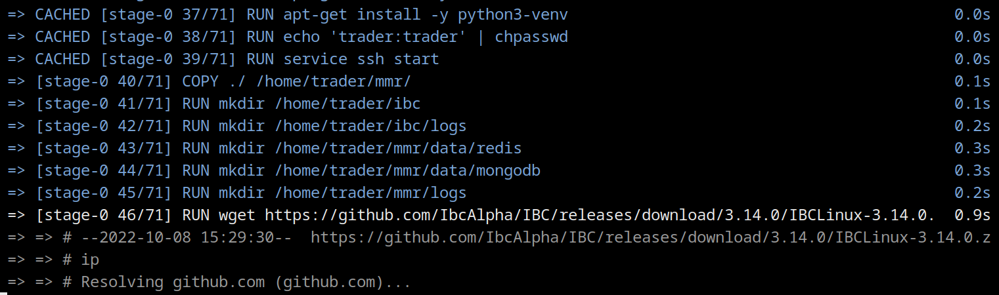

# Make Me Rich!


Python based algorithmic trading platform similar to [QuantRocket](www.quantrocket.com) and others. It uses the Interactive Brokers brokerage API's to download historical data, and route/execute its trades.

You can use MMR in three ways:

1. Complete automated and algorithmic trading: MMR will subscribe to instrument ticks, pipe them to your algo, and you provide the signal for automatic trading.
2. Fully interactive terminal prompt: get quotes, create, cancel, change orders etc from a live terminal prompt.
2. Command line trading: get quotes, create, cancel and change orders etc, all from the Windows, MacOS or Linux command line.

MMR hosts the Interactive Brokers Trader Workstation instance, maintains connection, ensures consistency and reliabilty between your Interactive Brokers account and your local trading book. It's opinionated about the programming abstractions you should use to program your algos, but will meet you at the level of abstraction you want.

It relies on:

* [RxPy 4.0](https://github.com/ReactiveX/RxPY) for asyncio pipelining and programming abstraction, and [vectorbt](https://github.com/polakowo/vectorbt) for algorithm programmability and backtesting.
* Batch download of historical instrument data from [Interactive Brokers](https://www.interactivebrokers.com/en/home.php) and [Polygon.io](https://www.polygon.io).
* [Arctic Timeseries and Tick Store](https://github.com/man-group/arctic) for tick data storage and super-fast retrieval.
* No fancy Web x.x technologies, just simple and easily extended Python services.
* Docker build and deploy on Ubuntu 20.04 LTS + Python 3.9.5.
* and more...

### Status

- [x] Basic technical architecture completed (asyncio, caching, db layer, backtesting, historical data collection, messaging etc)
- [x] Polygon.io historical data collection
- [x] Interactive brokers historical data collection
- [x] Login; logoff; get positions; get portfolio;
- [x] Subscribe to bars, subscribe to ticks
- [x] Place, cancel, update orders for all Interactive Brokers instruments
- [x] Stop loss, trailing stop loss
- [ ] Backtesting
- [ ] Algorithmic Strategy API and extensibility hooks (started)
- [ ] Strategy and portfolio risk analysis (started)
- [ ] Add/remove strategies

There is still about 2-3 months of work left before MMR is 'shippable'. If you want to help speed that up, send me a message.

## Installation

### Docker Installation (easiest)

The simplest way to install and run MMR trader is via Docker. It will use an Ubuntu 21.04 image, install Python 3.9, install all requirements, and automatically install the latest version of Interactive Brokers Trader Workstation.

```
$ git clone https://github.com/9600dev/mmr.git
$ cd mmr/
$ ./docker.sh --build  # builds the mmr image (default name mmr-image)
$ ./docker.sh --run    # runs the mmr image in a container (default name mmr-container); automatically ssh'es into the container to continue TWS configuration
```



The script will build the docker image and run a container instance for you.

Once it's built and running, ssh into the container to continue the installation and configuration of Trader Workstation:

```
>> 0a97a73dcbccdeadd6b7f9abee1a945dfb1d909b78255a72f97e156063ac4bf1
>>
>> ip address: 172.17.0.2
>> ssh into container via trader@localhost -p 2222, password 'trader'

$ ssh trader@localhost -p 2222
```


Enter your Trader Workstation username and password. The script will proceed to automatically install the latest Trader Workstation version.

After this has completed, it will start a [tmux](https://github.com/tmux/tmux/wiki) session with two commands:

* `pycron` (MMR's process spawner and scheduler) which handles the process scheduling, maintenance and uptime of the MMR trading runtime, ArcticDB, Redis, X Windows, and Trader Workstation, ready for automatic trading. You can manually call this by: ```python3 pycron/pycron.py --config ./configs/pycron.yaml```
* `cli` which is command line interface to interact with the trading system (check portfolio, check systems, manually create orders etc). You can manually call this using ```python3 cli.py```.
* `info` a simple realtime dashboard that observes the MMR runtime. Displays positions, portfolio, and strategy logs.
* `trader_service_log` displays the trader service log real time (see below for information on this service).
* `strategy_service_log` displays the trader service log real time.


When starting MMR for the first time, there are a couple of things you should do:

#### Checking MMR status:

* ```status```


#### Bootstrapping the symbol universes

After ensuring everything is connected and functioning, you should bootstrap the population of the "symbol universe". This is MMR's cache of most of Interactive Brokers tradeable instruments, mapping symbol to IB contract ID (i.e. AMD -> 4931).

* ```universes bootstrap```


This command will grab the symbols for NYSE, NASDAQ, ASX, LSE, CFE, GLOBEX, NYMEX, CBOE, NYBOT, and ICEUS and stash them in their respective "universes". The command typically takes a good couple of hours to complete.

A Universe (like "NASDAQ") is a collection of symbols and their respective Interactive Brokers contract id's to which you can apply your trading algo's to. You can resolve a symbol to universe and contract id via:

* ```resolve --symbol AMD```


From here you're good to go: either using the `cli` to push manual trades to IB, or by implementing an algo, through extending the `Strategy` abstract class. An example of a strategy implementation can be found [here](https://github.com/9600dev/mmr/blob/master/strategies/smi_crossover.py). There's still a lot to do here, and the implementation of the strategy runtime changes often.

### Manual Installation

See [docs/MANUAL_INSTALL.md](docs/MANUAL_INSTALL.md)

### Trading Manually from the Command Line

There are two ways to perform trades and inspect the MMR runtime manually: from the command line, or through the CLI helper.

To fire up the CLI helper, type:

* ```python3 cli.py```


This gives you a range of options to interact with the MMR runtime: inspect orders, logs, trades etc, and manually submit trades from the CLI itself:

* ```mmr> trade --symbol AMD --buy --limit 60.00 --amount 100.0```

While most command inputs take the string symbol (in this case "AMD") its best to use the unique contract identifier that Interactive Brokers supplies, and you can do this via the ```mmr> resolve``` command:


Trading from your command line interface of choice is also supported:

* ```/home/trader/mmr $] python3 cli.py trade --symbol AMD --buy --market --amount 100.0```

There's also a terminal based dashboard to quickly inspect the runtime, orders, algos and prices [TODO: this is under active development]:

* ```python3 info.py```


### cli.py commands

You can choose to use the REPL (read eval print loop) via ```python3 cli.py``` or by invoking the command directly from the command line, i.e. ```/home/trader/mmr $] python3 cli.py trade --symbol AMD --buy --market --amount 100.0```

| Command       | Sub Commands | Help |
| :-------------| ----:|:------|
| book          | cancel orders trades | shows the current order book |
| clear         | | clears the screen |
| company-info  | | shows company financials when connected to polygon.io [in progress] |
| exit          || exits the cli |
| history       | bar-sizes get-symbol-history-ib get-universe-history-ib jobs read security summary | retrieves historical price data from IB or Polygon.io (in progress) for a given security or universe. Use "history bar-sizes" for a list of bar sizes supported |
| option        | plot | gets option data for a given date and plots a histogram of future price |
| portfolio     | | shows the current portfolio |
| positions     | | shows current positions |
| pycron        | | shows pycron status |
| reconnect     | | reconnects to Interactive Brokers TWS |
| resolve       | | resolves a symbol (i.e. AMD) to a universe and IB connection ID |
| snapshot      | | gets a price snapshot (delayed or realtime) for a given symbol |
| status        | | checks the status of all services and systems |
| strategy      | enable list | lists, enables and disables loaded strategies |
| subscribe     | list listen portfolio start universe | subscribes to tick data for a given symbol or universe, optionally displays tick changes to console |
| trade         | | creates buy and sell orders (market, limit) with or without stop loss |
| universes     | add-to-universe bootstrap create destroy get list | creates and deletes universes; adds securities to a given universe; bootstraps universes from IB |

## Implementing an Automated Algorithm/Strategy

TODO:// explain how to do this once it's fully coded.

## Debugging

You can VNC into the Docker container which will allow you to interact with the running instance of TWS workstation. Screenshot below shows [TigerVNC](https://tigervnc.org/) viewing a stalled TWS instance waiting for authentication:


All services log debug, info, critical and warn to the following log files:

* ```logs/trader.log``` for most module level debug output
* ```logs/error.log``` for critical/error logs
* ```logs/trader_service.log``` for trader_service
* ```logs/strategy_service.log``` for strategy_service

## Development Notes

Something weird happening? Want to know more about a particular abstraction? Check out the [docs/DEV_NOTES.md](docs/DEV_NOTES.md) doc.

# Direction

MMR's scalability target is many trades per minute to a couple of trades per month:


Therefore, needs to support a wide range of strategy requirements:

* [low frequency] Risk analysis of portfolio compared to market conditions: re-balancing. Tax implications etc.
* [medium frequency] Trade strategies that span multiple days/weeks: mean reversion over time.
* [semi-high frequency] Momentum trades spanning minutes, quick exits from risky positions, market making (selling buying calls and puts) etc.
* **Non-goal is sub-second high frequency trading**.

## Block architecture


#### High level product requirements/architecture choices:

* Live market feeds for prices etc are saved and "re-playable" via simulation. (not done)
* Historical data can be use to "replay" previous days/months/years of trading (i.e. use bid, ask, price, last_price, volume, etc to simulate the IB market feed) (not done)
* Two dominant data-structures the platform is based on:
  * DataFrames that represent prices, which can be 'windowed' over time. (done)
  * Reactive Extensions for real time/reactive algorithmic programming. (done)
* *_service.py are independent processes, and multiple instances of them can be spun up for horizontal scalability. Each process communicates via ZeroMQ messages with msgpack as the compressed message container. See more [here](https://zeromq.org/messages/). Ticks arrive as pandas dataframes. (done)

### Pycron ```pycron/pycron.py```

Pycron deals with scheduling, starting, stopping and restarting processes, services, and tasks. It features:

* Sorting out the starting of process dependencies.
* Restarting processes that crash
* Scheduling the start/stop/restart of jobs for specific times/days
* Runs periodic health checks
* Has a small tornado based webservice that allows for remote control of processes

[todo explain the other services]

# License

This work is [fair-code](http://faircode.io/) distributed under [Apache 2.0 with Commons Clause](LICENSE.md) license.
The source code is open and everyone (individuals and organizations) can use it for free.
However, it is not allowed to sell products and services that are mostly just this software.

If you have any questions about this or want to apply for a license exception, please contact the author.

Installing optional dependencies may be subject to a more restrictive license.

# Disclaimer

This software is for educational purposes only. Do not risk money which you are afraid to lose.
USE THE SOFTWARE AT YOUR OWN RISK. THE AUTHORS AND ALL AFFILIATES ASSUME NO RESPONSIBILITY FOR YOUR TRADING RESULTS.

...
...

# Scratch Notes and Links

## Macro

* [Thread on compounding](https://twitter.com/10kdiver/status/1482367267291553799)
* [Quit while you're ahead](https://www.hussmanfunds.com/comment/mc220325/): "The problem with simple P/E ratios (or even P/E ratios based on year-ahead estimates of “forward” earnings) is that stocks are not claims on a single year of earnings. A good valuation measure is just shorthand for a proper discounted cash flow analysis, and relates the current price with observable fundamentals that are representative of decades of likely future cash flows. High P/E multiples on earnings that rely on elevated profit margins. Once a high P/E and a high profit margin are embedded into price, both have to be sustained indefinitely in order for prices to avoid very strong headwinds."
* [The Greatest Predictor of Future Stock Market Returns](http://www.philosophicaleconomics.com/2013/12/the-single-greatest-predictor-of-future-stock-market-returns/): Total Return = Price Return from Change in Aggregate Investor Allocation to Stocks + Price Return from Increase in Cash-Bond Supply (Realized if Aggregate Investor Allocation to Stocks Were to Stay Constant) + Dividend Return.
* [My Investing Nightmare](https://ofdollarsanddata.com/my-investing-nightmare/): "While the Great Depression was objectively more damaging to capital markets, it happened over a much shorter time period. I cannot imagine seeing stocks decline consistently for four years only to be followed by a weak four year rally, then two more years of declines."
* [Modern Financial System and Constant Growth, a thread](https://twitter.com/LynAldenContact/status/1507391873379454981): "A high-leverage system can't take shocks. If businesses, households, and sovereigns are all highly-levered, it requires constant growth to avoid a systemic meltdown."
* [Great thread on poker and trading](https://twitter.com/NeckarValue/status/1506268234995187712): "Trading decisions should be based on conditional
probability."; "Information doesn’t exactly flow perfectly, like they teach you in Finance 101. Frequently, the information will show up first in the option market. A lot of these insider trading cases involve options, and we’re the
people who lose the money."
* [Minksy Moments in Venture Capital](https://pivotal.substack.com/p/minsky-moments-in-venture-capital?s=r)
* [Lecture on Minsky Moments](https://www.youtube.com/watch?v=G9_nqc-A5_Y)
* [The Oil Market in six tweets](https://twitter.com/BurggrabenH/status/1504945787637227520): "The industry needs to replace ONE North Sea each year (3mbpd) just to stay still (more in future due to base declines). That needs $600bn. Industry didn’t and does not invest it. Meanwhile demand is back at pre-Covid levels."
* [Another good oil thread](https://twitter.com/PauloMacro/status/1505229277444325380)
* [Oil and the USD, good thread](https://twitter.com/UrbanKaoboy/status/1471531050396307462)
* [Asset bubbles and interest rates thread](https://twitter.com/INArteCarloDoss/status/1495475236980068360)
* [Gold and the USD](https://twitter.com/WifeyAlpha/status/1497879761330257922)
* [Does not compute](https://www.collaborativefund.com/blog/does-not-compute/): "To suppose that the value of a common stock is determined purely by a corporation’s earnings discounted by the relevant interest rates and adjusted for the marginal tax rate is to forget that people have burned witches, gone to war on a whim, risen to the defense of Joseph Stalin and believed Orson Welles when he told them over the radio that the Martians had landed."
* [Geopolitics Megathread](https://twitter.com/UrbanKaoboy/status/1403757685225390087)
* [Everything must be paid for twice](https://www.raptitude.com/2022/01/everything-must-be-paid-for-twice/)
* [The Fed and Crashing Markets - Thread](https://twitter.com/krugermacro/status/1480081861124804612)
* [The Volatility Tax - Thread](https://twitter.com/10kdiver/status/1479881189217296386)
* [The folly of ruling out a collapse](https://www.hussmanfunds.com/comment/mc210808/)
* [Carl Icahn's Alpha - a thread](https://twitter.com/FabiusMercurius/status/1426203313263890441)
* [The Roaring 20's](https://roaring20s.substack.com/p/august-8-1921?s=r)
* [Cultural and Economical Collapses](https://mobile.twitter.com/svalver/status/1414864136299847682)


## Analysis

* [Ten threads that teach you accounting](https://twitter.com/thealexbanks/status/1500876409731903489)
* [Learning to trade options, a thread](https://twitter.com/FabiusMercurius/status/1502680794204016642)
* [Mental Models: Financial Assets as Levers (thread)](https://twitter.com/UrbanKaoboy/status/1467174640162279425): “stocks as bonds,” why “duration of CFs” matter, and why many tech stocks resemble “30-year zero-coupon bonds” – how even a small shift in rate expectations can move valuations A LOT.
* [Pricing long dated options, a thread](https://twitter.com/intothegossan/status/1514260835618623494)
* [How discount rates impact valuation, a thread](https://twitter.com/CharlieMunger00/status/1511577720308006912): “Interest rates are to asset prices what gravity is to the apple. When there are low interest rates, there is a very low gravitational pull on asset prices"
* [Factor based investing](https://twitter.com/FabiusMercurius/status/1510322281758617601)
* [Ten investing books that changed my life and P&L](https://twitter.com/FabiusMercurius/status/1500190848943681539)
* [Minksy Moments in Venture Capital](https://pivotal.substack.com/p/minsky-moments-in-venture-capital?s=r)
* [Retained Earnings Thread](https://twitter.com/10kdiver/status/1485006207832051715)
* [A Summary of Factor Investing](https://twitter.com/ReformedTrader/status/1195450353472303104)
* [A History: War, Oil Prices, Inflation and Trade](https://investoramnesia.com/2022/03/13/a-history-war-oil-prices-inflation-trade/)
* [The relationship between illiquidity and volatility](https://twitter.com/ftx_chris/status/1526896272434929664)
* [The true reason why central banks do QE](https://themacrocompass.substack.com/p/portfolio-rebalancing-qe#details)
* [Why does the stock market go up?](https://visioninvesting.substack.com/p/why-does-the-stock-market-go-up)
* [Reading a profit and loss statement](https://lethain.com/profit-and-loss-statement/)
* [15 images every investor needs to remember](https://twitter.com/BrianFeroldi/status/1553731179546718208)
* [Thread on QE and why central banks are still engaged in it](https://mobile.twitter.com/MacroAlf/status/1558892593597104128)
* [Sharpe Ratio](https://seekingalpha.com/article/4239442-your-sharpe-ratio-is-low-for-reasons-bad-golf)

## Structure

* [Options Market Structure - 101](https://frontmonth.substack.com/p/options-market-structure-101-b18?s=r)
* [Carbon footprint of crypto](https://blog.dshr.org/2022/02/ee380-talk.html)
* [Hidden Intel Trapped in Options Chain Data](https://threadreaderapp.com/thread/1474855205728501760.html)
* [Turning Networks into Economies](https://twitter.com/cdixon/status/1429585831899983876)
* [Generating Functions, a thread](https://twitter.com/10kdiver/status/1426597150993965057)
* [Thread on how clearing houses work, and what happened in the RH GME debarcle](https://twitter.com/compound248/status/1355274739351248898)

## Trading Ideas

* [10 Under-the-cover Trading Hacks](https://twitter.com/FabiusMercurius/status/1492569620569489409)
* [Systematic Trading blog](https://qoppac.blogspot.com/p/systematic-trading-start-here.html)

## Tools

* [Fintopea](https://www.fintopea.com/quote/AAPL/income-statement): Visualize 30+ years of company balance sheets and income statements for free.
* [The book of secret knowledge - a long list of tools](https://github.com/trimstray/the-book-of-secret-knowledge)
* [Financial Modeling Prep](https://site.financialmodelingprep.com/financial-statements/META): good tool for discounted cash flow modeling, intrinsic value of companies etc.
* [PortfolioLabs](https://portfolioslab.com/tools) - sharpe, calmar, treynor, sortino, etc.
* [Random notes about Trader Workstation TWS](https://dimon.ca/dmitrys-tws-api-faq/)
* [OpenBB - a thread on its features](https://mobile.twitter.com/theBuoyantMan/status/1558792415263088641)
* [10 free finance tools](https://mobile.twitter.com/gurgavin/status/1560748089635651584)
* [i8 Terminal](https://github.com/investoreight/i8-terminal)

## Finance Math

* [Common Statistical Tests are Linear Models](https://lindeloev.github.io/tests-as-linear/#51_independent_t-test_and_mann-whitney_u)
* [Portfolio correlation](https://alpaca.markets/learn/correlation-portfolio-python/)
* [Understanding Options Greeks](https://mobile.twitter.com/TradrNate/status/1555938610301440000)
* [Importance of Investment Runway](https://mobile.twitter.com/10kdiver/status/1561414787145224193)

## Random Finance Links

* [Bloomberg terminal overview](https://www.optionsbro.com/bloomberg-terminal-review/)
* [Percentage Changes, logarithmic returns discussion](https://www.reddit.com/r/algotrading/comments/uduv5s/a_mathematical_consideration_that_is_stumping_me/)
* [Superinvestors - list of hedge fund portfolio changes](https://www.dataroma.com/m/home.php)
* [Worldwide bond yield curves](http://www.worldgovernmentbonds.com/inverted-yield-curves/)
* [IB Product Listings](https://www.interactivebrokers.com/en/index.php?f=1563&p=fut)
* [Interactive Brokers Format Guide](https://www.sierrachart.com/index.php?page=doc/IBSymbols.html)
* [IB Symbol Guide](https://www.linnsoft.com/support/symbol-guide-ib)
* [Ming Zhao - Hidden Intel trapped in Options Chain Data (amazing thread)](https://twitter.com/FabiusMercurius/status/1474855205728501760)
* [Ming Zhao - what to sell](https://twitter.com/FabiusMercurius/status/1479915943576813568)
* [The fed and inflation](https://twitter.com/krugermacro/status/1480081861124804612)
* [Great thread on Volatility Tax](https://twitter.com/10kdiver/status/1479881189217296386)
* [Trader's Notes -- TWS API notes](https://dimon.ca/dmitrys-tws-api-faq/)
* [Split the spread, TWS orders](https://www.clientam.com/en/index.php?f=26817)
* [Alpha Architect - White Papers](https://alphaarchitect.com/alpha-architect-white-papers/)
* [Trading Economics - good flat, simple data site](https://tradingeconomics.com/)
* [Spectre - GPU based backtester](https://github.com/Heerozh/spectre)
* [Tradytics - AI stock tool](https://tradytics.com/overall-market)
* [Redtide - yahoo finance scraper](https://github.com/qks1lver/redtide)
* [Financial data of 4400+ public companies](https://www.kaggle.com/qks1lver/financial-data-of-4400-public-companies/data)
* [Finviz - Market Heat map](https://finviz.com/map.ashx)
* [Quantpedia - Historical Data](https://quantpedia.com/links-tools/?category=historical-data)
* [Reddit - algo trading wiki](https://www.reddit.com/r/algotrading/wiki/index)
* [Historical Options chains](http://base2.optionsdatamine.com/page.php?section=PAGE1_index)
* [Market in-and-out - good screener](https://www.marketinout.com/correlation/stock-correlation.php?symbol=MSFT&period=30&sorting=cor&desc=1)
* [Stock Returns forecasting using Bayesian methods](https://github.com/yxue02/Stock-returns-forecasting-using-Bayesian-methods)
* [Hacker News discussion on the harmonic paper](https://news.ycombinator.com/item?id=19214650)
* [Portfolio Visualizer](https://www.portfoliovisualizer.com/backtest-asset-class-allocation?s=y&mode=1&timePeriod=4&startYear=1972&firstMonth=1&endYear=2020&lastMonth=12&calendarAligned=true&includeYTD=false&initialAmount=10000&annualOperation=0&annualAdjustment=0&inflationAdjusted=true&annualPercentage=0.0&frequency=4&rebalanceType=1&absoluteDeviation=5.0&relativeDeviation=25.0&portfolioNames=true&portfolioName1=Harry+Browne+Permanent+Portfolio&portfolioName2=Ray+Dalio+All+Weather&portfolioName3=TIPS&asset1=TotalStockMarket&allocation1_1=25&allocation1_2=30&asset2=LongTreasury&allocation2_1=25&allocation2_2=40&asset3=TreasuryBills&allocation3_1=25&asset4=Gold&allocation4_1=25&allocation4_2=7.50&asset5=IntermediateTreasury&allocation5_2=15&asset6=Commodities&allocation6_2=7.50&asset7=TIPS&allocation7_3=100&fbclid=IwAR11LDUb5XkQ2Er4LdHkT21wglIBpmogVHOCFjUyhTe-wWOqIBgP7nBdKqA)
* [Why this is unlike the great depression (better and worse)](https://www.lynalden.com/great-depression/?fbclid=IwAR1SFz6bnvHTN2VxVCXMRPeSh5-WzE4uWEe2TARQ7LYdFw7kA9116IGWlJY)
* [Ultimate Guide to Safe Withdrawal Rates](https://earlyretirementnow.com/2016/12/07/the-ultimate-guide-to-safe-withdrawal-rates-part-1-intro/?fbclid=IwAR2ioz9FhQysXiQHAgrbmw_7qN8RrU5JDsUWgylpHWPuyRSzpKAFl4sVoO0)
* [Vangaurd Nest Egg Calculator](https://retirementplans.vanguard.com/VGApp/pe/pubeducation/calculators/RetirementNestEggCalc.jsf)
* [Minafi.com](https://minafi.com/interactive-guide-early-retirement-financial-independence#part-2)
* [Financial Mentor](https://financialmentor.com/calculator/best-retirement-calculator)
* [Machine Learning and Data Landscape](https://mattturck.com/data2021/)
* [Semi-controversial career advice](https://twitter.com/FabiusMercurius/status/1408883428712321024)
* [Understanding Jane Street](https://www.thediff.co/p/jane-street?triedSigningIn=true)


## The same old boom notes:
* [Same old boom link](https://investoramnesia.com/2020/09/13/the-same-old-boom/)
* One of the main takeaways is that even with greater access to information through technological innovations (in this case the ticker, but could be Robinhood, etc. today), uninformed traders will actually demonstrate increased herding behavior and pile into the same stocks despite having more information on a broader pool of stocks to select from. Feels similar to the recent speculative boom by retail investors that seems to have focused heavily on Tesla and Apple.
* ‘Each new dollar invested into passive index funds must purchase the securities in the benchmark index. These purchases exert an inexorable influence on the underlying securities. Per Sharpe’s own work, these are not passive investors – they are mindless systematic active investors with zero interest in the fundamentals of the securities they purchase.
* ‘How does access to information affect price efficiency? We address this question by studying the stock ticker; a device that disseminated price changes to brokerage offices with a ticker subscription. We find that an increased number of ticker subscriptions in a state strengthened the return continuation and return co-movement of firms headquartered in the state. Therefore, the increased dissemination of price changes appears to have decreased price efficiency by increasing uninformed trend chasing. Our results challenge the assumption that greater access to information improves price efficiency.‘


* The main takeaway from this article is that Value underperforms in the Installation Phase, but outperforms after the Turning Point, as the cycle enters the Deployment Phase.


* (https://github.com/hmmlearn/hmmlearn)
* (https://quantstrattrader.wordpress.com/)
* (https://www.reddit.com/r/Python/comments/7thmfp/best_framework_for_systematic_trading/)
* (https://www.quantstart.com/articles/Quantitative-Finance-Reading-List/)
* [Trading Calendar](https://github.com/Emsu/prophet/blob/master/prophet/utils/tradingcalendar.py)
* (https://github.com/benjaminmgross/visualize-wealth)
* (https://www.reddit.com/r/algotrading/comments/jye0bj/literature/)
* (https://github.com/mrjbq7/ta-lib)
* (https://github.com/hudson-and-thames/mlfinlab)
* (https://github.com/pyro-ppl/numpyro)
* [A better pickle](https://github.com/uqfoundation/dill)
* [Public API's - a list](https://github.com/public-apis/public-apis)

## Trading Systems

* (https://app.breakingequity.com/#/tradings/live)
* (https://github.com/robcarver17/pysystemtrade/blob/master/docs/introduction.md)
* (http://pmorissette.github.io/bt/index.html#what-is-bt)
* (https://qtpylib.io/docs/latest/algo.html)
* (https://github.com/polakowo/vectorbt)
* (https://github.com/michaelchu/optopsy)
* (https://github.com/wilsonfreitas/awesome-quant)
* (https://github.com/twopirllc/pandas-ta)
* (https://github.com/jankrepl/deepdow)
* (https://github.com/quantopian/trading_calendars)
* (https://github.com/litl/backoff)
* (https://databento.com/pricing)
* (https://github.com/jialuechen/strats)