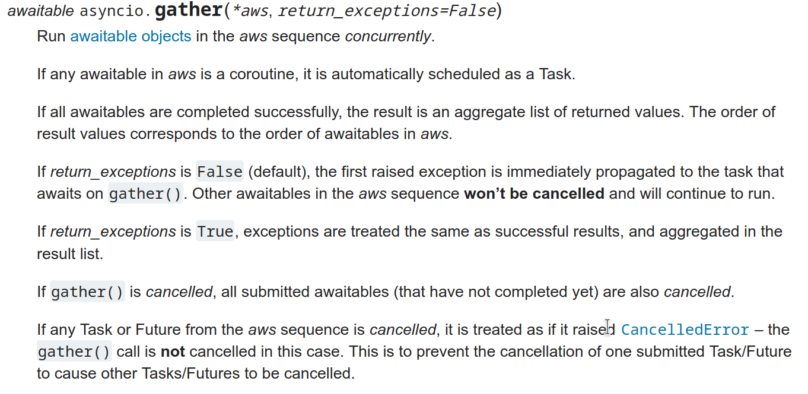
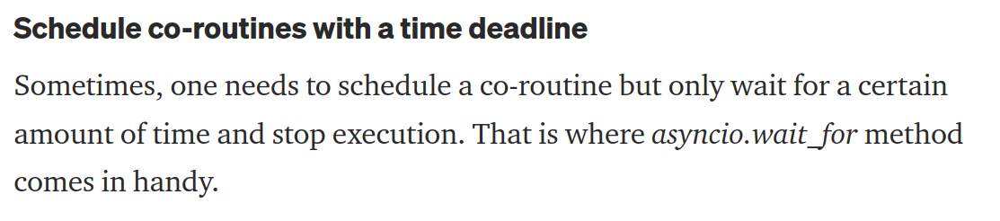

# Backlog

* timezonify should move everything that's deailing with internal timezones to timezone.utc
* there's a timezoneTWS property on IB that gives you the TWS instance timeframe, use that.
* Move timezoneify logic to the SecurityDefinition class, so that timezone updates to dt.datetime's are local to the security/market
* ```listener_helpers.py``` and ```helpers.py``` need to be consolidated.
* The batch queuing stuff is a bit wonky (there's a subclass there ```queuer.py``` but it's doesn't have the right abstraction). Given batch data downloads is going to be important, should probably clean all this up.
* There's no testing framework setup, and no test coverage. Setup test framework. Add tests.
* For all the command line tools, we have switches that are 'defaulted' to 127.0.0.1 etc, but we also have ```configs/trader.yaml``` configuration file. Reconcile these two. We probably need some sort of dependency injection/configuration injection style thing.
* IB order "conditions" aren't exposed yet: https://interactivebrokers.github.io/tws-api/order_conditions.html. Enable these.
  * 

# Development Notes

* Largely following [this guys approach](https://mitelman.engineering/blog/python-best-practice/automating-python-best-practices-for-a-new-project/#how-to-manage-python-versions-with-pyenv) to build/test/package management etc.
* Using poetry + pyenv for local dev, pinning to Python 3.5.9 (default Ubuntu 21.04 installation)
* Exporting requirements.txt from poetry for a Docker default pip install
* We set AcceptIncomingConnectionAction=accept in IBC's config.ini, which should automatically accept incoming API connections to TWS. This is insecure, so either set it to "manual", or configure it yourself when you fire up TWS for the first time.
* Arctic: don't ever call store.list_libraries() without specifying a cache reset parameter: store.list_libraries(1), otherwise you may get an old cache without the latest libraries you've built.
* Remove the backoff stuff, implement this properly.

## What to do when things don't work

* If TWS is failing to start via IBC, have a look at the IBC logs in /home/trader/ibc/logs.
* ib_status() returning False and you can't start TWS? `export TRADER_CHECK=False` and that call will be ignored. That function screen scrapes (https://www.interactivebrokers.com/en/?f=%2Fen%2Fsoftware%2FsystemStatus.php) and occasionally will get a red status that doesn't actually impact trading.

## Backlog

* ib_status() needs to deal with the ambiguity of outages vs. outages of specific exchanges we don't actually care about:
* 
* traitlets is broken on 5.2.1 and 5.2.2, version assertion error. Forced install of 5.2.0
* ExitAfterSecondFactorAuthenticationTimeout=yes doesn't work (crash on startup). Setting to 'no' works fine.

## Random code in random places worth knowing about:

  * ```python3 polygon_queuer.py --contracts ../../data/ib_symbols_nyse_nasdaq.csv``` does the same price history download, but using polygon.io.
* ```trader/scripts``` directory contains a bunch of helpers to grab the complete lists of symbols from various exchanges around the world; contains symbol -> interactive broker 'conId' resolution (```ib_resolve.py```) and more.
* ```trader/scripts/trader_check.py``` will do a bunch of system checks to make sure all services are up, and interactive brokers is responding
* ```trader/listeners/ibreactivex.py``` is the RxPY concurrency wrapper around the Interactive Brokers API. If you're not familiar with reactive programming, start with the RxPY website.
* ```pycron/pycron.py```is the workhorse for process scheduling. It makes sure all services and processes are continuously running (restarting if they're not) and checks for dependencies. It will also start, stop and restart services on a crontab like schedule.
* Docker build failing, not being able to resolve DNS? Try:
  * sudo pkill docker
  * sudo iptables -t nat -F
  * sudo ifconfig docker0 down
  * sudo brctl delbr docker0
  * sudo service docker restart

## Asyncio Lifecycle

* 
* [https://docs.python.org/3/library/asyncio-task.html](https://docs.python.org/3/library/asyncio-task.html)
* [https://python.plainenglish.io/how-to-manage-exceptions-when-waiting-on-multiple-asyncio-tasks-a5530ac10f02](Managing exceptions in the asyncio lifecycle)
* There are three main types of awaitable objects: coroutines, Tasks, and Futures.
    * Tasks are used to schedule coroutines concurrently. When a coroutine is wrapped into a Task with functions like asyncio.create_task() the coroutine is automatically scheduled to run soon.
    * 
    * "Save a reference to the result of this function, to avoid a task disappearing mid execution. The event loop only keeps weak references to tasks. A task that isn’t referenced elsewhere may get garbage-collected at any time, even before it’s done. For reliable “fire-and-forget” background tasks, gather them in a collection"
    * 
    * Python coroutines are awaitables and therefore can be awaited from other coroutines:
    * 
    * 
    * 
    * 
    * 
    * 
    * 

## aio-/reactive

deprecated, moved to rxpy 4.0 instead -- it's significantly fasterx

* Must dispose of disposables, otherwise the Mailbox processor used for processing messages passed through to Observables will continue to hold asyncio tasks. This causes the dreaded "Task was destroyed, but still PENDING" exception when closing down the loop.
* observable = rx.from_async(client.get_contract_history(..))
* await observable.subscribe_async(rx.AsyncAnonymousObserver(my_asend))
    * subscribe_async sets up a disposable, and a token (cancellation token?), then calls safe_observer
    * save_observer sets up a MailboxProcessor and calls start, passing in the worker() message_loop
    * this message_loop waits for inbox.receive() not sure what this does yet
    * MsgKind.ON_NEXT calls msg.accept_observer (which calls 'obv.asend(self.value)')
    * aio-reactive 3x filter: total (ms): 2388.098
    * inline if else: total (ms): 850.931


## Devenv reading


* https://realpython.com/dependency-management-python-poetry/#add-poetry-to-an-existing-project
* https://jsvine.github.io/visidata-cheat-sheet/en/

## Random


Observable xs = pipe(
    subject
    rx.take(2)
)

* MailboxProcessor.start is ultimately the reason why we're starting tasks.

* safe_observer() takes a observer, and an action to do on dispose_async()
    * safe_observer creates and AnonymousObservable which "sits on top of" the passed in observer. Passing through the asend/athrow/aclose, but injects the passed in action to dispose/cancel. In our case: cts.cancel(), which calls task.close()
    * I think safe_observer is doing all the heavy lifting of starting and stopping the tasks.
    * if the worker loop of safe_observer (started by a task) is no longer running, the task presumably completes. Close or Error is required for that.

* auto_detach_observer


* take(Observable) -> Observable
* take() takes an observable (subject), builds a subscribe_async method
    * the subscribe_async method OBSERVES that observable and takes only the required elements
    * it wraps the passed in Observer in safe_obv via auto_detach
    * it creates an AsyncAnonymousObserver, wiring up its own asend() method to do the /take/ filtering, but wires through athrow and aclose to the passed in observer.
    * pipe wires up the subject, through the anonymousobserver, through to auto_detach.
    *

* start_immediate() wires up the "task.cancel()" method to the CancellationToken "listeners", sounds like you can have multiple actions if you want to hit the "cancel" button on the CancellationToken
    * Calling "dispose" on a CancellationTokenSource will eventually find that token and invoke the listener, which is task.cancel()
*

* rx.take(1) call's "aclose()" or OnCompleted when it hits
* just having a "rx.filter" with no asend doesn't spin up any tasks - not calling asend/aclose doesn't make a difference
* rx.take(3) calling subject.asend(5) once leaves the task open
* rx.take(3) calling subject.asned(5) once then a aclose() closes the task
* auto_detatch_observer calls "cancel()"
    * CancellationTokenSource -> cancel() self.dispose()
    * dispose() for all listeners?? call the continuation
    * which in this case is cb() task.cancel()


