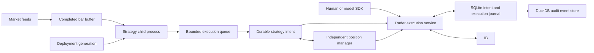

# Strategy execution contract

This describes the September 2026 remediation implementation. Validation and
known limits are recorded in [the remediation report](REMEDIATION_2026-09-08.md).
The [original review](ARCHITECTURE_REVIEW_2026-09-08.md) records the earlier
counterexamples. The [human-owned invariants](../tests/invariants/README.md)
remain authoritative.

The contract separates a signal, submission, broker acceptance and execution.
Only observed executions establish strategy inventory. Neither a successful RPC
nor a proposal marked `EXECUTED` promises a fill.

## Identity and supported deployment

An instrument is identified by its exact conId. Symbol matching cannot authorize
an exit or transfer ownership. The trader pins its broker account and verifies
paper/live mode. Quantities, security type, currency and multiplier are resolved
before the opening portion is authorized.

Native contract definitions retain the broker-supplied multiplier through
catalogue storage and contract conversion. Missing or invalid derivative
multipliers refuse notional sizing and opening valuation. Definitions stored
without a multiplier remain readable but require a catalogue refresh to obtain
that value; no derivative multiplier is inferred from the symbol or security
type. The existing multiplier-of-one default for stocks and forex is unchanged.
Within the requested catalogue scope, conflicting multipliers for the same
conId, security type and currency refuse resolution before a venue copy is
selected, including when one entry is missing the value. Numerically equal
positive values such as `100` and `100.0` agree. Fresh and cached lookups
consider the same complete candidate set and preserve its order; integer
conIds and numeric ticker strings remain distinct. Mutations through one
accessor serialize with its lookups and invalidate its cache. Writers using
another accessor or the object store directly must invalidate other readers
or restart them before relying on refreshed catalogue metadata.

A deployment has a fresh generation, source SHA-256, class, effective typed
parameters and effective-configuration hash. The same parameter conversion is
used in research and live execution. The hash covers the strategy source and
configuration; it does **not** attest installed dependency versions or an entire
container image. Gauntlet records match both source hash and class. CLI
deploy/enable requires a PASS. Direct YAML runtime enforcement requires
`MMR_GAUNTLET_ENFORCE=1`; the legacy default remains warn-only.

`strategies deploy` writes YAML atomically, requests application, and checks the
runtime's applied configuration. A saved file with no runtime acknowledgment is
reported as application unconfirmed. Removal, replacement and disable revoke
opening authority when applied or observed by the runtime. Explicit control
requests apply this revocation synchronously; direct YAML or source edits await
the reconciliation loop, normally every 30 seconds. A queued BUY checks its
generation again when executed. Failed replacements cannot retain the
superseded opening authority. Source changes are checked even when the YAML
timestamp is unchanged.

Live strategies must implement `on_prices`. Classes implementing only `on_bar`
or `on_panel`, and weekly/monthly live intervals, are rejected explicitly.
Panel research results do not imply live portfolio-rebalance support.

Strategy import, construction, installation and callbacks run in a spawned child
process. It receives a price-frame copy, context and read-only data facades, with
no supported trader/runtime mutation API. Default budgets are 60 seconds for
initialization, 5 seconds per callback, 32 MiB per serialized frame, and a bounded
pending queue sized to the subscription set (maximum 256). Timeout, process exit
or overflow puts that strategy into ERROR and revokes openings. Stateful
callbacks are not silently allowed to skip an overloaded bar.

This process boundary limits failures; it is **not an OS security sandbox**.
Python has the service user's filesystem/network privileges. A per-process
memory limit is optional and Linux-only; the default does not impose one.
Only trusted code should run under the service account. There is no durable
checkpoint of arbitrary strategy Python state: restart reconstructs the
strategy and its declared historical context.

## Bars and callbacks

Intraday indices are UTC bar-start instants. Daily indices are midnight-UTC
**session-date labels**, not market-open instants. Daily live aggregation follows
the venue session, including sessions crossing midnight UTC. Historical venue
midnight and UTC date labels normalize to the same session identity.

Historical and live frames both exclude the forming interval and apply session
filtering to all rows. Known lunch breaks are excluded. Daily bars become
eligible after the session's configured close, including extended hours where
the calendar provides them. Unknown calendars and calendar lookup errors retain
the existing logged fail-open data policy. This is distinct from execution risk
inputs, which fail closed for new exposure.

History reads that fail are retried; downloaded history invalidates cached
frames. Declared historical lookback is respected. A completed read is not a
proof that every expected bar exists: a vendor can return gaps or an empty
range. Strategies must handle short/empty data. The runtime does not invent
missing bars.

One incremental bar buffer is shared per instrument/interval. Same-interval
quotes update scalars rather than repeatedly resampling retained history. Raw
health/sample ticks are capped at 2,048 after a buffer is established. Each
worker receives a copy, so its changes cannot alter another strategy's input.
Old ticks cannot rewrite already delivered bars, and dispatch watermarks are
monotonic within a runtime generation. A revision to an already dispatched
historical bar is not replayed as a fresh live decision.

Cumulative volume starts from the first observed value; subscribing midday
does not assign the entire day's volume to one minute. The first interval
contains observed data only, not reconstructed pre-subscription trades.
The normalized OHLCV interface does not provide a complete trade-versus-quote
provenance or vendor-correction feed. Tick aggregation, historical vendor bars
and research fills are not promised to be numerically identical.

Stored bars pass required-schema and structural-quality checks. Invalid rows
cannot enter `tick_data`. Quarantine is auditable during normal storage
operation; a quarantine write failure is logged while valid bars can still be
committed. No claim is made that failed storage durably captures every rejection.

## Submission and reconciliation

| Observation | Meaning and caller obligation |
|---|---|
| Queue admission | Work entered bounded process memory. This is not a durable receipt. |
| Durable intent | A stable intent ID was committed before broker submission. Query/reuse that ID. |
| Rejected before broker submission | Validation or opening policy refused the request. Inspect the reason. |
| Submitted | Order IDs identify attempted orders; a placement receipt alone does not prove broker acceptance. |
| Broker accepted | An acknowledgment matched the exact physical order; requested quantity is not inventory. |
| Partial fill | Confirmed cumulative execution quantity is owned; the remainder can still fill. |
| Cancel requested | The order remains executable until terminal broker evidence. |
| Cancelled / broker rejected | Its unfilled remainder is terminal; earlier fills remain real. |
| Unknown | A side effect may have occurred. Reconcile the same intent; do not invent a replacement ID. |

These facts are not a single linear enum: a partially filled order can have a
pending cancellation or unknown remainder. `SuccessFail` remains the transport
compatibility wrapper. Its success result and proposal `EXECUTED` can follow a
placement receipt whose broker acknowledgment timed out. They establish an
attempted submission, not broker acceptance or a position. Reconcile using the
same durable intent ID and its matched lifecycle observations; proposal terminal
rows are not reused as a fill ledger.
A split close-and-flip response preserves the reduction's order IDs and a
separate opening result if that opening is rejected or unknown.

SDK approval saves a successful split outcome while the proposal is still
`APPROVED`, before committing `EXECUTED`; terminal rows remain immutable.
If receipt processing or persistence fails after placement begins, the
returned failure explicitly reports `UNKNOWN`, retains the original error
and available observed IDs or partial outcome, and does not attempt a new
`FAILED` transition. A write may already have committed, so reconciliation
uses the actual durable state and the same intent ID.

The strategy executor persists an intent before proposing/approving. SDK
approval uses a stable proposal-derived intent ID. Standalone protection, resize
and emergency reductions also carry IDs. The trader claims the ID and records
broker order IDs before placement. Reusing an ID with a different account or
payload is an error. Broker `orderRef` carries the correlation ID while retaining
the strategy prefix used by the PnL ledger.

New native orders reserve a positive integer broker order ID before submission;
zero cannot be reserved because IB treats it as an instruction to allocate
another ID. Acceptance waits follow the returned Trade's account, client,
instrument, direction, reference and permanent identity. A reused numeric ID
from another order cannot supply its acceptance or rejection. Provisional
receipts require the actual observed Trade; ambiguous legacy numeric lookups
remain unknown.

RPC deadlines include lock acquisition, send and reply wait. A timeout does not
cancel a dispatched server handler. A legacy caller that discards its returned
intent identity cannot safely implement retries by sending a new request.

Normal recovery uses SQLite WAL with FULL synchronous commits, alongside the
trading database as `<trading-db>.execution.sqlite3`. It is separate from
historical DuckDB contention. Broker callbacks snapshot primitive facts into a
bounded queue; an ingestion worker durably records progress/execution receipts
and an idempotent outbox retries DuckDB audit delivery. Overflow or ingestion
failure is visible and disables opening readiness until broker replay recovers
it. Order-attempt audit is committed to the outbox before broker send and awaited
off the broker loop so opening-rate and turnover checks do not race
fire-and-forget accounting. Unconfirmed attempts are charged conservatively;
a crash cannot refund a potentially submitted opening. A never-sent attempt
can therefore consume budget even though no broker fill exists.

Snapshots report position and order observations, execution-replay readiness,
and journal health separately. Reconnect replays IB execution history. Missing
orders, an incomplete startup read, or an unresolved older intent are not
evidence of no fill.

Numeric order lookups select the current broker client. An explicit intent
lookup retains its reserved client identities, and the global order snapshot
retains all observed physical orders. Adopted protective orders with distinct
proven native identities keep separate fill checkpoints when numeric IDs recur.
An aliasless legacy checkpoint still requires its exact historical identity;
permanent-ID enrichment alone cannot authorize a new adoption or recount.

The raw `executions` array contains diagnostic journal receipts, filtered only
by requested numeric order IDs. Without IDs it includes every receipt in the
journal, which can contain multiple accounts and broker clients. Receipts carry
account, permanent broker ID and numeric order ID; they omit client ID.
`executions_complete` reports broker-history replay readiness. Strategy
attribution uses the intent-matched cumulative fill evidence in `orders`.

An intent-scoped snapshot accounts for every reserved physical order, including
both legs of a split. It waits for an in-flight parent placement to finish
extending that list; one completed leg cannot finish the whole intent. Broker
requests run after releasing the placement lock. A missing numeric order ID can
be associated through its exact reference and permanent ID only when the
single-order topology is unambiguous; no cancellation ID is invented.
IB's history window is bounded; separate broker requests are not an atomic
account snapshot. Unknown historical side effects remain unresolved when the
available broker evidence cannot establish their outcome. There is no
exactly-once delivery guarantee across SQLite, DuckDB, ZMQ and IB.
An unknown final fill quantity can still expose a confirmed lower bound of
owned shares. Broker terminal status proves that no remainder can execute;
it does not prove the final fill quantity. Those facts remain separate during
exit coordination. A recovered quantity without a proven fill price carries
unknown cost basis: affected realized PnL and incomplete unrealized totals are
reported unavailable. Later cumulative prices do not rewrite earlier audit
fills automatically.

A price attached to one execution
may value that execution's audit fill without establishing the average for all
shares filled so far. A cumulative average must match the cumulative quantity
used for ownership; a last-fill price can substitute only when that execution
covers the entire quantity. Otherwise owned cost stays unavailable even when
the latest audit fill has a known price. Later aligned cumulative evidence can
restore the basis without adding quantity or repeating audit fills. Previously
stored positive checkpoints from the faulty fallback still require
reconciliation; the correction does not identify them automatically.

Assigning a broker permanent ID does not create a new execution checkpoint.
The tracker retains the original durable identity across acknowledgment,
midnight and restart, preserving cumulative fills and audit idempotency.
Permanent IDs supplied in the order, order status and execution must agree.
On initial journal attachment, durable checkpoints and identity mappings are
loaded before buffered broker observations are interpreted in arrival order.
Both memory and persistence preserve already observed fill progress; a lower
or missing terminal quantity cannot erase a known partial fill or silently
resolve its final quantity. An older inconsistent snapshot recovers the durable
quantity as an UNKNOWN lower bound.
Ambiguous identity records are explicitly marked and cannot be added together
as ownership evidence. Previously duplicated audit history is retained for
review; it is not silently rewritten, and opening readiness remains blocked
until the ambiguity is reconciled.

## Ownership, exits and protection

The long-only executor attributes observed opening fill deltas, and subtracts
observed closing/protective fill deltas. It never adopts the requested quantity
or all shares in the broker account. A manual holding in the same conId does
not become strategy inventory. Attributed reductions are clamped to a finite,
fresh broker position.

Each continuous attributed holding has a unique `ownership_epoch`. Partial
opening fills and pyramid adds preserve it; an opening after flat creates a new
UUID, even if bar labels or clock values repeat. For a new journaled opening,
its recorded start comes from the original opening intent's immutable creation
time, before proposal and approval, rather than when a fill is processed.
The explicit `record_open` compatibility path uses the ownership declaration
time. Legacy opening origins can remain unknown.

| Identity | Lifetime and purpose |
|---|---|
| Holding ownership UUID | Identifies the inventory to which a physical reduction's fills belong. Preserved across adds. |
| Latest-BUY policy entry | Determines bar/time exits and changes on an add. It does not transfer an existing broker order to different inventory. |
| Exit request | Records the current entry and exact already-pending opening attempts it is authorized to close. It may need multiple physical attempts. |
| Physical reduction intent | Binds the final selected holding before first submission. Retries retain that identity and binding. |

Late closing or protective fills with established ownership advance their
original intent checkpoint. They cannot debit a later holding's inventory.
This check and the inventory update share one transaction. Cached emergency
accounting applies the same holding binding and subtracts only fills beyond
the captured checkpoint.

An existing legacy holding without an ownership epoch cannot receive a fresh
automated add. Entry preflight refuses before creating a new intent or proposal.
Confirmed fills from earlier submissions still reconcile; the refusal does not
discard executed shares or infer the missing ownership identity.

An automated BUY refuses an observed broker short in the same instrument.
This is an entry preflight check, not segregated custody for offsetting manual
and strategy positions. External trading after that observation can invalidate
the ownership assumptions. In particular, opposite-direction manual overlap
is unsupported: netting the broker position to zero can make the executor
recognize its remaining attribution as externally closed.

An accepted close remains pending until its executions/remainder reconcile.
Partial fills followed by cancellation preserve the filled inventory. Unknown
cancellation retains management and executable-order reservations. A protective
order is checked for quantity as well as identity; an acknowledged stop ID alone
is not evidence of adequate coverage.

Terminal broker status alone does not release a tracked protective reservation.
Matching intent-scoped replay must first apply its cumulative fills to the owned
inventory checkpoint. If that replay fails or remains uncertain, cancellation
completion and replacement stay deferred across executor restart. A global
broker balance can include manual shares and cannot replace this ownership
proof.

Protective replacement refreshes execution evidence after cancellation and
terminal probes, then reloads owned quantity, owned cost basis and broker quantity before
calculating a replacement. A fill during cancellation cannot leave a stale
larger replacement plan in use. If ownership is gone or refreshed inputs are
unreadable, repair defers without submitting the stale plan. If a new fill
makes owned cost unavailable while cancellation completes, the old stop can
already be terminal. Replacement then waits for adequate price evidence and
logs the owner, conId, ownership epoch and cause. This cancel-and-replace path
does not guarantee uninterrupted protection.

An adopted stop retains its local checkpoint ID while separately recording
its exact broker intent ID. A newly discovered order must identify a protective
order type; a generic SELL receipt does not establish that it is a stop.
First-time adoption requires immutable server-claim
provenance linked to the current holding before attributing any fills, including
when the stop remains live after a partial fill. A live remainder reserves
executable capacity; it does not prove ownership of the prior fills. Ambiguous
or prior-entry observations cannot be assigned to whichever position is open
now. The server supplies creation provenance only for an exact durable
account/reference/physical-order mapping; an observation timestamp is not a
creation timestamp.

For an already tracked stop, IB’s `ValidationError` is a validation warning,
not terminal evidence. Exact restored server-claim provenance can allow
reconciliation to recover that holding’s attribution and checkpoint confirmed
fills while the warning status remains. The warning alone establishes neither
broker acceptance nor adequate protective coverage.

An exit request has a lifetime separate from its broker order. A newer due
timer is retained while an older close is working or unknown, then handed to
one residual close after the earlier attempt reconciles. The retained timer
is bound to its entry epoch; it cannot close an unrelated later entry. An
explicit SELL records the owned entry and exact opening attempts already
pending when the request is processed. If a stale ownership cache is needed,
already-committed opening fills not yet published to that cache are also
covered at this point. That scope survives narrower timer
successors: a delayed fill from a captured add still belongs to the SELL,
even if it establishes a later entry epoch. Retries do not add new opening
attempts to that scope; a fresh explicit SELL can extend it. Timer-only requests
retain the later-BUY-wins rule.

If durable ownership matches a captured SELL but its published cache still
lags, the request remains pending until the view catches up. That check cannot
authorize a send from stale inventory or retain an old request against an
unrelated new holding.

A fully filled close can still owe a reduction when a covered opening later
reveals additional owned shares. The request retires once ownership is flat and
the covered openings' final quantities are resolved, so completed requests
cannot revive on a future position.
Historical filled orders without an active-request marker are not inferred to
be outstanding exits.
Overload and emergency recovery follow the same request lifetime. If an
emergency attempt has no observed orders, handing its successor a new broker
identity requires authoritative evidence that the earlier attempt sent none.
Current emergency references carry the physical attempt's holding UUID as well
as a locator when an existing durable close request is available. The parent
must match uniquely by identity, strategy and conId. The parent establishes
request scope; the child UUID establishes where that attempt's fills belong.
A parent whose scope spans multiple openings does not transfer a submitted
child's ownership. A present parent locator that resolves to no unique matching
request cannot authorize further closes. A raw reference without a parent
locator can preserve only demand for a matching current holding; it does not
prove the original policy entry, recover a lost pending-add scope or authorize
closes of a different ownership epoch. A reference without an exact child
binding cannot prove physical ownership on cold recovery.

The trader serializes its order workflows and coordinates competing reductions
and protection. An exit may displace only working reductions of its own owner
class (a strategy is its own class; `mmr buy/sell`, `approve` and other
operator paths are one class): when the shares it needs are reserved by
orders owned elsewhere it is refused `DEFERRED` before any cancellation is
sent, naming those orders, and the foreign protection stays working. A partial
shortfall clamps the exit to the unreserved quantity. Standalone protective
orders remain exit-only and size-clamped.
Protective-stop price correction uses a bounded search for the accepted finite
numeric domain. The price must remain below entry; if no cent price satisfies
that rule, management retries without placing an invalid stop. This arithmetic
bound does not promise a particular broker or RPC latency.
Before broker submission, the server reserves the physical order identity and
its account, instrument, direction and quantity. Durably recorded reservations
survive restart; a missing acknowledgment or missing broker order does not
release their capacity. Once a send may have occurred, release requires exact
terminal evidence with known final fill quantity; logical intent completion
alone cannot release it. A definitely unsent preallocation can be discarded.
During a journal outage, reductions can use a process-local emergency
reservation. That fallback is logged and does not promise crash durability:
recovery after process loss depends on the available broker evidence.
In-place modifications retain their
verified physical identity so they are not counted as a second order.
A stale exit classification cannot authorize an opposite opening at the final
placement boundary. Resizing is server-coordinated: supported protected trims
use a matching existing protective tranche and broker OCA reduce-with-block.
An unsupported topology, including splitting one full-position stop into new
tranches during a partial trim, returns DEFERRED before changing those orders.
Growth requires the reviewed opening pipeline.

Time exits, pending-order reconciliation and protective repair are managed
independently of strategy callbacks, through a periodic manager and retained
position policies. Disabling/removing/erroring a strategy stops new openings
while its inventory stays managed. Bar-count and close-by-time rules use bar
timestamps, not a fabricated count of elapsed wall-clock bars. Daily timestamps
remain session labels; a daily callback is not an intraday clock scheduler.
The observed-bar count persists per entry epoch, so frame eviction and service
restart do not reset a holding period. A later BUY starts the new policy epoch
and invalidates queued timers for the earlier entry. Under overload, owned
timer work coalesces with a count and watermark, independently of strategy
signals. Staged observations remain in memory until the management worker
commits them; queue admission is not a durable checkpoint. Only forward
observations count; missing bars are not invented and
late older data does not retroactively advance a timer.

Policy limits, proposal requirements and arming never refuse a genuine reduction.
This does not promise an immediate physical close: identity, inventory and
competing-order uncertainty can require reconciliation before a safe order can
be submitted. A journal outage refuses opens. An already-owned exit can use a
broker-facing recovery path when cached confirmed ownership, fresh complete
broker positions and competing-order capacity remain evaluable. The server
can use a previously complete reservation census during a later outage, with
subsequent emergency reservations included. After a cold restart, an unreadable
reservation journal leaves reductions pending: a partial emergency cache cannot
prove that earlier executable orders are absent. In-memory emergency
state and broker correlation are used when durable writes fail. If neither
journal accepts a request and the process dies before broker submission, that
request cannot survive restart. Degraded durability and pending/unknown exits
are reported; they are not mislabeled successful fills.
A close claimed locally but never proposed or submitted does not block its
emergency fallback. Unknown, submitting and recovered working broker attempts
retain their reservations and still require reconciliation, including completed
history without a usable numeric order ID. If an intent-scoped history read
fails, that close remains pending before another proposal. A complete global
position snapshot cannot replace that evidence: an earlier partial fill must
be attributed before sizing the remaining close. A native close retired before submission
records that fact atomically; terminal status alone cannot prove an older
attempt was unsent. A crash before proposal allocation can resume the same
durable request without treating broker uncertainty as permission to retry.
The emergency inventory cache reads owned quantity, exit policy, protection
and the applied fill checkpoints in one DuckDB transaction. Intent-journal
acknowledgments may lag or reflect incomplete replay; they are not used as the
checkpoint for this cached inventory. Later confirmed fills adjust the cached
quantity only by their unapplied delta.

Legacy rows without immutable ownership/creation evidence remain unknown;
migration never substitutes deployment time or invents a holding UUID for them.
Existing working protection is retained while its attribution is unresolved.
Automatic replacement and close coordination defer with an actionable warning
until that attribution has been explicitly reviewed and reconciled. The
explicit act is `mmr strategies adopt NAME CONID --attest [--avg-cost X]`
(strategy_service RPC `adopt_legacy_holding`): it requires a complete broker
position read corroborating at least the attributed quantity, assigns the
ownership epoch, and records the declared cost basis as one priced opening
interval whose event id carries the attestation timestamp, so the audit shows
the basis was declared rather than observed. It is single-shot per holding and
never runs automatically. Until it runs, the holding's time exits use the
loaded strategy's real interval and session; a holding with no recorded policy
and no loaded strategy has its time exits deferred with one error line, never
run under a default interval or zone. Direct
server reductions can proceed against the live account position when the
server can independently establish available reduction capacity. Legacy
physical reservations with unknown instrument, direction or quantity keep
deferring until this process has completed its open-order and execution
replay; after that, an identity under this trader's own client id that no
observation matches is not working and is settled durably. An identity under
another client id can never be matched (IB reports such orders with orderId
0) and continues to require reconciliation; migration does not invent that
missing evidence. The
existing `mmr reconcile` command reports divergence; it does not attest or reset
ownership. No automatic legacy ownership-reset workflow is introduced here.

Run one authoritative trader service for an account. MMR cannot enforce
cross-client reservations against simultaneous manual/TWS orders or another
independent trader process. Broker positions can change between observation
and submission. Automatic corporate-action ownership adjustment, execution
bust/correction accounting and arbitrary ownership transfers are not supported
by this contract. Such discrepancies require operator reconciliation; do not
mix external trading on managed inventory while assuming strict exclusive
ownership or broker-wide oversell prevention.
Run one authoritative strategy executor for an attribution database as well.
Intent metadata and inventory live in separate journals; the snapshot assumes
one executor writer. SQLite reservations do not establish safe inventory
coordination between overlapping strategy-service processes.

Protective prices use the strategy’s own quoted opening-fill cost, not the
account position’s average cost. Cost evidence and quantity progress commit
together and survive restart. Adds contribute their actual cost; reductions
remove cost proportionally in committed attribution-ledger order. This is not
exchange-time or tax-lot reconstruction. Evidence is bound to the ownership epoch, so late
receipts from an earlier holding cannot reprice a new one. Missing or
contradictory observed price evidence makes the basis unavailable rather than
substituting another account holding’s cost. Legacy holdings with no cost
history retain existing stops, while new price plans wait for owned evidence.
Unpriced current opening receipts may recover price-only evidence even after
their quantity is final. Finalized priced fills are not automatically reopened
for broker price corrections or execution busts.

## Opening authorization and money units

Whole-share sizing floors the affordable quantity and refuses a budget below
one share. Rounding correction uses a bounded search for native finite float
inputs, including extreme amounts; it cannot stall policy evaluation in a
one-share-at-a-time loop. This arithmetic bound is not an RPC latency promise.

Every supported placement path reaches structural validation and the shared
opening checks. Quantity/amount resolution precedes classification. A flip is a
reduction plus a separately gated opening remainder. Pure closing parents do
not receive children that would recreate exposure. Raw expressive RPC calls
cannot use a caller assertion as evidence of an approved proposal.

Opening policy includes the filter, approval/approver tier, margin, risk inputs,
position concentration and applicable rate/turnover limits. Working opening
orders contribute to aggregate concentration. Unreadable, nonfinite or sentinel
prices, margin values, account values and FX conversions refuse opens. Monetary
comparisons use the named unit: account-base amounts for account limits and USD
for USD tiers, including the contract multiplier. Missing conversion is not
silently treated as rate 1.

The daily-loss input comes from IB's account-level PnL subscription for the
exact configured account and empty model code. It requires a callback for the
current connection's exact request object. Per-position PnL, a flat book and
an empty local fill history do not establish the account's daily total. Missing,
invalid or sentinel values make this input unevaluable and refuse openings;
they do not refuse reductions.

Disconnect, reconnect and upstream-loss boundaries revoke the previous PnL
receipt before waiting or cleaning up. The replacement subscription must
receive its own callback, including when IB reports that data was maintained.
The daily period follows the broker's PnL reset convention; this is not an
independent ledger reset at local midnight. The per-position display feed
remains separate from this risk input.

Auto-execution additionally checks the current generation, running state,
paper restriction, live double-arm, manifest, cooldown and bar staleness at
execution time. These opening gates do not strand owned positions on disarm.

The freshness check requires a finite bar age, a positive finite bar interval
and a positive finite age multiplier whose computed threshold is finite.
Missing or nonfinite age, an unavailable interval and an unrepresentable
threshold refuse BUY openings and additions with an explanation. The runtime
uses interval zero when conversion fails; that value cannot establish
freshness. Finite negative ages retain their existing session-label behavior,
positive sub-second intervals remain supported, and equality at the age
threshold passes this check. Freshness does not refuse SELL reductions.

`MMR_STALE_BAR_MULTIPLE` defaults to 3 when unset, empty, malformed, nonfinite
or nonpositive. A valid positive configured value is retained, including a
fractional value; if its product with the interval is nonfinite, the opening
is refused. Direct decision callers must supply a positive finite multiplier
themselves. The timestamp helper reports an unparseable or nonfinite age as
unavailable rather than treating it as evidence of freshness.

Manifest order limits count distinct opening attempts, including pyramid adds,
across durable submission and activity records. The daily limit uses a rolling
24-hour window and the hourly limit a rolling hour, including the lower boundary.
A lost reply still consumes capacity when its submission is in the window.
Repeated logs and a receipt for the same intent count once; distinct attempts
recorded in different journals count separately. Closing attempts do not consume
this opening budget.

A successful SDK submission response records its observed receipt time with the
order identifiers before the activity log is written. That timestamp is neither
a broker acknowledgment nor a fill. If the receipt update itself cannot be
persisted, the earlier uncertain submission remains; this is not a promise of
durability through failure of every write.

Older activity records have no exact intent identity. They are counted separately
until they leave the window, which can conservatively refuse openings while old
logs overlap submitted intents. Migration does not infer identity from symbols,
reason text or bar timestamps. Their timestamps retain the existing local-time
convention; historical timezone and clock-fold provenance are not reconstructed.
Stop old strategy workers before upgrading the activity table: old positional
writes are incompatible with its added identity column. Mixed-version writers
and simultaneous independent executors are outside the single-writer contract.

The global `MMR_AUTO_EXECUTE_DISABLED=1` switch has broader legacy semantics:
it suppresses BUY and SELL signals. Server reduction APIs and independent
pending-order/time-exit management remain available.
Profitability evaluation is separate from these execution guarantees.

## Backup and operational evidence

Backups include DuckDB plus SQLite's committed WAL state through the SQLite
backup API, per-file hashes and a snapshot interval manifest. Only complete
snapshots replace `latest` or trigger retention pruning. The set is captured
over an interval, not by an atomic transaction across all databases.

Restore verifies the manifest/hashes, requires an empty target, and writes
`BROKER_RECONCILIATION_REQUIRED.json`. New exposure remains refused until an
operator reviews reconciliation and deliberately acknowledges the marker;
ordinary startup snapshots do not silently clear a possibly old restore gap.
Exits remain available. Docker automatic restore refuses legacy snapshots that
have no verifiable manifest; it does not delete those old backups.

Runtime status exposes deployment hashes/generations, worker health,
event-loop lag, bounded queue/durable-intent state and degraded execution
conditions. A responsive RPC, an IB connection, fresh market data and safe
opening readiness are separate observations. Consult the remediation report
for measured latency, fault regressions, paper coverage and final gate results.
