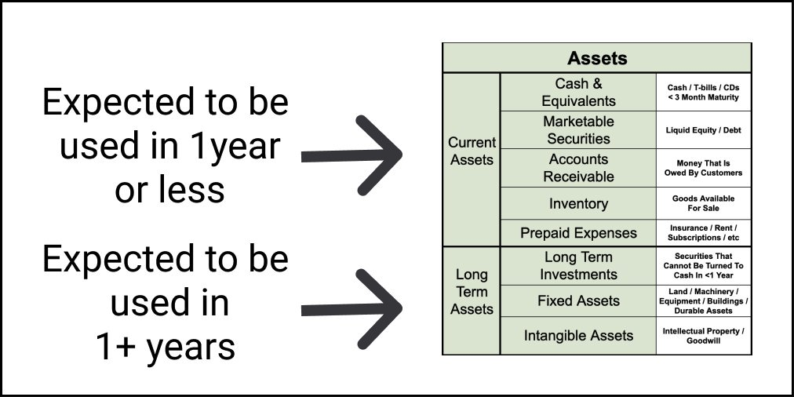
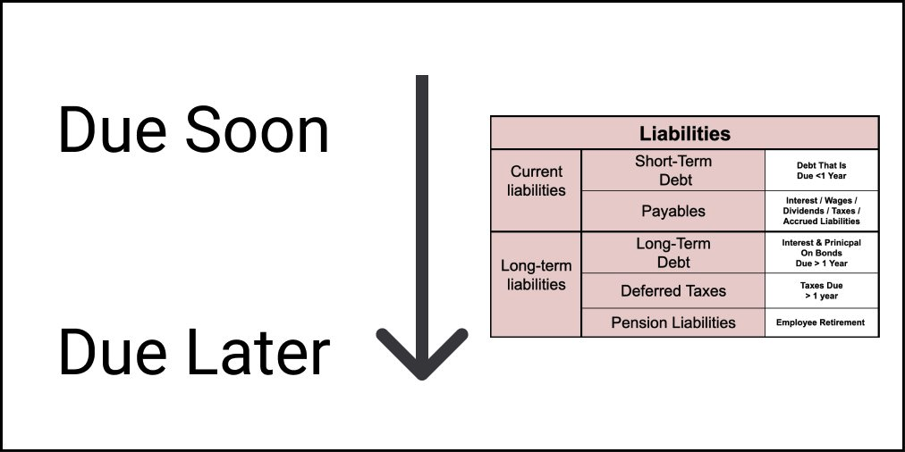
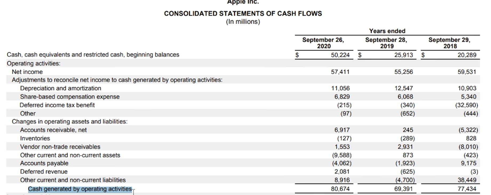
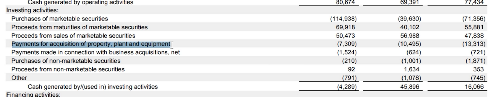

# Accounting

* [Ten threads that teach you accounting](https://twitter.com/thealexbanks/status/1500876409731903489)
* [Mental Models: Financial Assets as Levers (thread)](https://twitter.com/UrbanKaoboy/status/1467174640162279425): “stocks as bonds,” why “duration of CFs” matter, and why many tech stocks resemble “30-year zero-coupon bonds” – how even a small shift in rate expectations can move valuations A LOT.

### Assets = Liabilities + Equity (Owners/Shareholders)

(not sure where I lifted these quotes from):

> This can help you or a potential buyer understand who owns the company’s assets — is it other people (liabilities), or is it the business owner (equity)?

> The rule that Assets = Liabilities + Equity is important because Liabilities and Equity can be viewed as opposing forces. Notwithstanding the financial engineering and nuance around debt, liabilities in their purest sense are a balance of how much you've taken beyond what you've earned, while equity is a measurement of how much you've earned beyond what you've taken. The assets show what you have, but L&E show how everything was acquired.

> As a student, I really started to grokk accounting when I started thinking of double-entry accounting as the business application of Newton's law "For every action, there is an equal and opposite reaction." Whenever a change happens to one side of the financial statements, an exact and simultaneous change happens to the other side. Aggregated over a period of time, the financial statements both categorize and summarize these various changes.

> For those still confused about Assets, Liabilities, Equity, Credits, and Debits, let me see if I can give you a more intuitive primer:
>
> - Assets = Money you have. Liabilities = Money you borrowed from someone else. Equity = Money you earned.
> - All the money you have you either (i) borrowed from someone else or (ii) earned. In other words:
> - Assets (money you have) = Liabilities (money you borrowed) + Equity (money you earned).
>     When recording a transaction all you have to do is ask yourself two questions:
>
> 1.  Where did the money come from? (what is the Source) 2. Where did the money go? (what is the Use)
>     Suppose you borrow $100 from a bank:
> 2.  Where did the money come from? -> you borrowed it from someone else, so increase Liabilities by $100. 2. Where did the money go? -> to your checking account (money you have), so increase Assets by $100.
>     Adjustments to Source accounts (where money comes from) are Credits, adjustments to Use accounts (where money goes) are Debits, so we could revise the above statement to:
> 3.  Credit Liabilities $100 2. Debit Assets $100
>     That's basically it. The rest is just breaking things down into sub accounts (e.g. Assets:Checking or Equity:Income).

### How to read a balance sheet:

- Assets = Liabilities + Shareholder Equity
- Assets: listed on the balance sheet in order of liquidity.
    - Current Assets
        - Cash
        - Accounts Receivable
        - Inventory
    - Non-Current Assets (illiquid, and can't be expected to be converted into cash)
    - Two types:
        - Tangible non-current
            - Property, equipment, manufacturing
        - Intangible non-current assets
            - Patents, goodwill etc
- Liabilities
    - Current Liabilities (expected to be paid within a year)
        - Accounts Payable
    - Non-current liabilities
        - Bond that the company has issued
        - Pensions
- Shareholder equity
    - Common stock
    - Retained equity??
    - Book value of the company
    - Shareholder equity != Public Market Value
    - This value is what each shareholder would get if it closed its doors, paid its debt, and sold its assets.

### Example of Balance Sheet

* Excellent thread from [Brian Feroldi](https://twitter.com/BrianFeroldi/status/1443598989526450182):
* 
* 
* 
* 
* 

### Valuation and Pricing:

* Discounted Cash Flows and Business Valuation:
  * [Good introduction here](https://corporatefinanceinstitute.com/resources/valuation/dcf-formula-guide/) which also talks about the two different methods of deriving 'terminal value' (exit multiple or perpetual growth)
  * The equation (minus the terminal value part):
  * CF = Cash Flow in the period
  * r = the interest rate or discount rate
  * n = period number
   
   
  * DCF used in: valuation of businesses, project/investment in company, bonds, shares, property, anything that produces or has an impact on cash flow.

* "The intrinsic value of any stock, bond or business today is determined by the cash inflows and outflows, discounted at the appropriate interest rate, that can be expected to occur during the remaining life of the asset.
* "The present value of all future cash flows, added together".
	* How much cash will the business make in the future?
	* What are the future cash flows worth to you right now?
	* Owners Earnings = Operating Cash Flow - Maintenance Capital Expenditure
	* Operating Cash Flow:
        * 
	* Apparently Maintenance capital expenditure is tough to find in the income statement, so investors use free cash flow and total capex:
        * 
        * 
		* Total capex includes: maintenance capital expenditure + growth capital expenditure.
	* Using free cash flow is more conservative but less accurate, but you can work it out from any income statement:
    * 
    * 
    * 
    * 
	* EPS vs. Free Cash Flow:
		* "Reported earnings are influenced by a variety of arbitrary charges and credits that distort the results. For instance, because non-cash charges such as depreciation deduct from income, a firm that reported negative earnings may have actually earned money when you count the cash. Conversely, since some non-cash items add to earnings, a firm that reported positive earnings may have actually lost money on a cash basis."
		* "Operating cash flow, on the other hand, represents the actual cash that flowed into or out of a firm’s bank accounts resulting from its basic operations. On the downside, operating cash flow ignores capital expenditures, which include investments required to keep a company competitive in this rapidly changing world."
		* "Free cash flow solves that problem. It’s calculated by subtracting capital expenditures from operating cash flow. Thus, free cash flow is excess cash that a firm does not need to fund its basic operations and stay competitive. It could be used to cut debt, fund expansion, raise dividends, etc., all happy events for shareholders."
		* "However, free cash flow numbers often bounce around a lot from quarter to quarter. So, any single quarter’s numbers could lead to misleading conclusions Consequently, instead of using a single quarter, most analysts combine the number of the last four quarters, referred to as “trailing 12 months.”"
		* [Free Cash Flow explanation](https://www.investopedia.com/terms/f/freecashflow.asp)

* [Pricing long dated options, a Twitter thread](https://twitter.com/intothegossan/status/1514260835618623494)
* [How discount rates impact valuation, a Twitter thread](https://twitter.com/CharlieMunger00/status/1511577720308006912): “Interest rates are to asset prices what gravity is to the apple. When there are low interest rates, there is a very low gravitational pull on asset prices"
* [Factor based investing/pricing, a Twitter thread](https://twitter.com/FabiusMercurius/status/1510322281758617601)
* [A Summary of Factor Investing](https://twitter.com/ReformedTrader/status/1195450353472303104)
* [Retained Earnings, a Twitter thread](https://twitter.com/10kdiver/status/1485006207832051715)
* [Reading a profit and loss statement](https://lethain.com/profit-and-loss-statement/)

