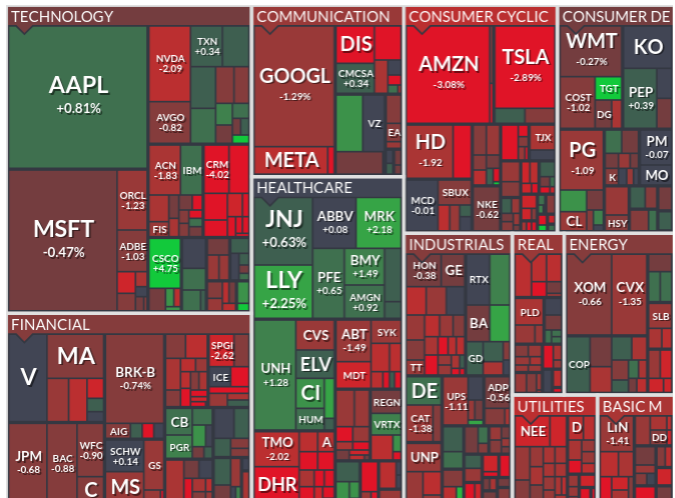
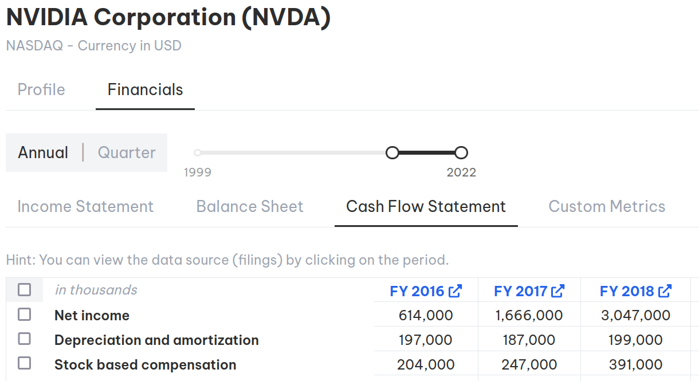
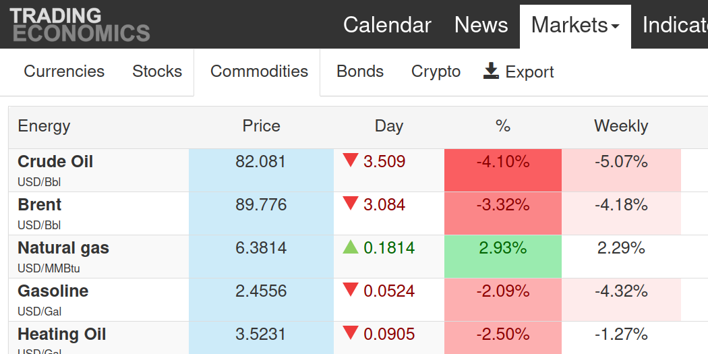

# Trading Systems, Software and Libraries

* [Qlib - Quant lib by Microsoft, looks good](https://github.com/microsoft/qlib)
* [How to setup IBC + TWS on headless Ubuntu to run two accounts, paper + real](https://dimon.ca/how-to-setup-ibc-and-tws-on-headless-ubuntu-in-10-minutes/)
* [How to Build an Exchange](https://www.janestreet.com/tech-talks/building-an-exchange/)
* [How NVidia's CUDA Monopoly in Machine Learning is Breaking](https://www.semianalysis.com/p/nvidiaopenaitritonpytorch)
* [ML Papers Explained](https://github.com/dair-ai/ML-Papers-Explained)
* [Which GPU's to get for Deep Learning](https://timdettmers.com/2023/01/16/which-gpu-for-deep-learning/)
* [einops - readable tensor operations](https://einops.rocks/)
* https://app.breakingequity.com/#/tradings/live
* https://github.com/robcarver17/pysystemtrade/blob/master/docs/introduction.md
* http://pmorissette.github.io/bt/index.html#what-is-bt
* https://qtpylib.io/docs/latest/algo.html
* https://github.com/polakowo/vectorbt
* https://github.com/michaelchu/optopsy
* https://github.com/wilsonfreitas/awesome-quant
* https://github.com/twopirllc/pandas-ta
* https://github.com/jankrepl/deepdow
* https://github.com/quantopian/trading_calendars
* https://github.com/litl/backoff
* https://databento.com/pricing
* https://github.com/hmmlearn/hmmlearn
* https://quantstrattrader.wordpress.com/
* https://www.reddit.com/r/Python/comments/7thmfp/best_framework_for_systematic_trading/
* https://www.quantstart.com/articles/Quantitative-Finance-Reading-List/
* [Trading Calendar](https://github.com/Emsu/prophet/blob/master/prophet/utils/tradingcalendar.py)
* https://github.com/benjaminmgross/visualize-wealth
* https://www.reddit.com/r/algotrading/comments/jye0bj/literature/
* https://github.com/mrjbq7/ta-lib
* https://github.com/hudson-and-thames/mlfinlab
* https://github.com/pyro-ppl/numpyro
* [A better pickle](https://github.com/uqfoundation/dill)
* [Public API's - a list](https://github.com/public-apis/public-apis)
* https://github.com/jialuechen/strats

## Tools

* [Trading View](https://www.tradingview.com/symbols/TVC-NDQ/): Pretty good vizualization tool. Integration with Interactive Brokers.
* [Finviz](https://finviz.com/): The 'poor mans Bloomberg'.
    
* [Fintopea](https://www.fintopea.com/quote/AAPL/income-statement): Visualize 30+ years of company balance sheets and income statements for free.
    
* [Trading Economics](https://tradingeconomics.com/): Flat, simple site. Contains commodity prices, currencies, stocks, bonds and crypto prices.
  
* [Financial Modeling Prep](https://site.financialmodelingprep.com/financial-statements/META): good tool for discounted cash flow modeling, intrinsic value of companies etc.
* [PortfolioLabs](https://portfolioslab.com/tools) - sharpe, calmar, treynor, sortino, etc.
* [Random notes about Trader Workstation TWS](https://dimon.ca/dmitrys-tws-api-faq/)
* [OpenBB - a thread on its features](https://mobile.twitter.com/theBuoyantMan/status/1558792415263088641)
* [10 free finance tools](https://mobile.twitter.com/gurgavin/status/1560748089635651584)
* [i8 Terminal](https://github.com/investoreight/i8-terminal)
* [Dataroma](https://www.dataroma.com/m/home.php): Portfolio updates of hedge funds and super investors.
* [Earnings Whispers](https://earningswhispers.com/): Dates/times of upcoming earnings reports, plus predictions.
* [The book of secret knowledge - a long list of tools](https://github.com/trimstray/the-book-of-secret-knowledge)
* [GetGuestimate -- probability spreadsheet](https://www.getguesstimate.com/)