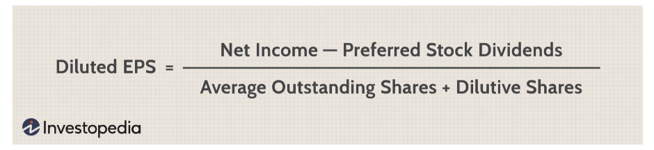
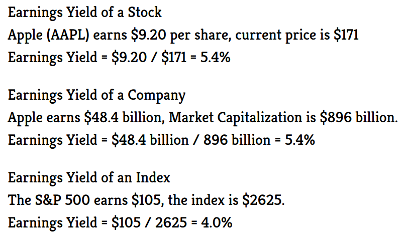
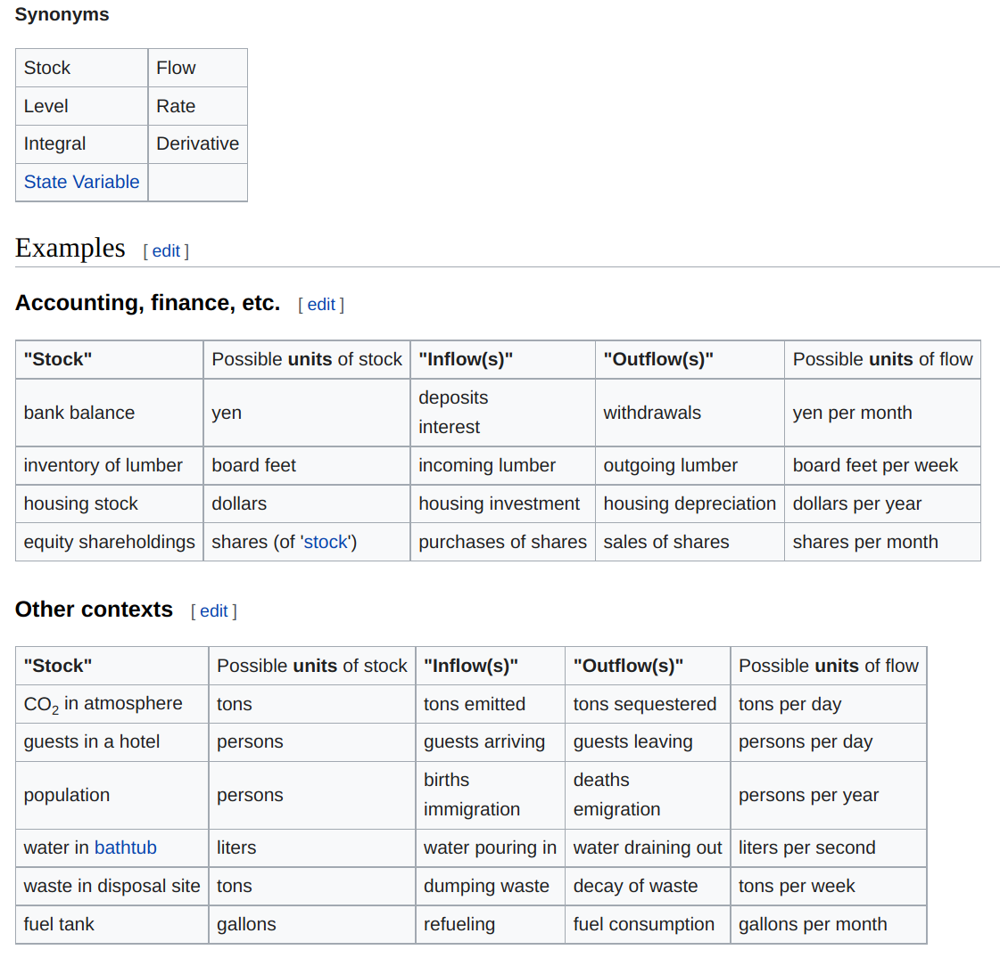

# Vocabulary

* **GAAP**: generally acceptable accounting principles
* **IFRS**: The International Financial Reporting Standards (IFRS), as set forth by the IASB, are a set of internationally-recognized accounting principles
* **Income Statement**:
	* **Revenue**: The amount of money a business takes in during a reporting period
	* **Expenses**: The amount of money a business spends during a reporting period
	* **Costs of goods sold (COGS)**: The cost of component parts of what it takes to make whatever it is a business sells
	* **Gross profit**: Total revenue less COGS
	* **Operating income**: Gross profit less operating expenses
	* **Income before taxes**: Operating income less non-operating expenses
	* Net income: Income before taxes less taxes
	* **Earnings per share (EPS)**: Division of net income by the total number of outstanding shares]
	* **Depreciation**: The extent to which assets (for example, aging equipment) have lost value over time
	* **EBITDA**: Earnings before interest, depreciation, taxes, and amortization
	* **Comprehensive Income**: (relatively new) is the variation in a company's net assets from non-owner sources during a specific period. Comprehensive income includes net income and unrealized income, such as unrealized gains or losses on hedge/derivative financial instruments and foreign currency transaction gains or losses.
* **Earnings**: are the net benefits of a corporation's operation. Earnings is also the amount on which corporate tax is due. For an analysis of specific aspects of corporate operations several more specific terms are used as EBIT (earnings before interest and taxes) and EBITDA (earnings before interest, taxes, depreciation, and amortization).
	* There are different types of earnings from the top to bottom of income statements. Such earning measures show the profits that a company can gain at different stages.
		* **Earnings Before Interest, Taxes, Depreciation, and Amortization (EBITDA):** measures the earnings before taking the taxes, costs of financing, and costs of capital investments into consideration. Companies with large amounts of depreciable or amortizable assets – such as buildings, manufacturing machines, and patents – usually see large gaps between their EBITDA and operating income. EBITDA strips out the obscure and extraneous expenses and can thus reflect a company’s operational performance more clearly. It is also more difficult for companies to manipulate their EBITDA. However, since the U.S. GAAP does not require companies to disclose their EBITDA, the calculation of EBITDA might vary for different companies.
		* **Earnings Before Interest and Taxes (EBIT)**: EBIT is also known as operating income. It is calculated by deducting the operating expenses from the total revenues. The operating expenses include the cost of goods sold, depreciation and amortization costs, SG&A, and other expenditures incurred by the company’s normal operation.The EBIT metric strips out the impact of taxes and the cost of financing. It reflects a company’s profitability purely based on its normal operations.
		* **Earnings Before Taxes (EBT)**: EBT measures a firm’s earnings before taking out its taxes or adding tax benefits. It shows a company’s operating and non-operating earnings. Effective tax rates usually vary between different companies and years. Thus, removing the effects of taxes can better reflect a company’s profitability when comparing it with peers or identifying a trend year over year.
		* **Net Income (Net Earnings)**: Net income, also known as net earnings, can be calculated by deducting the taxes from EBT. It appears at the bottom of an income statement and takes all the factors and expenses into account. It is the earnings attributable to the company’s shareholders. Net income can either be distributed to shareholders as dividends or retained by the company for future investments. Compared with EBITDA and EBIT, net income is more susceptible to different accounting methods. Since it includes obscure expenses, it is also more likely to be manipulated.
		* **Earnings Per Share (EPS)**: EPS is calculated by dividing the net earnings of a company by the number of common shares outstanding. It measures the money that the company earns for each share of its stocks.
		* **Diluted Earnings Per Share**: Conversely, diluted EPS is a metric used in fundamental analysis to gauge a company’s quality of EPS assuming all convertible securities have been exercised. Convertible securities include all outstanding convertible preferred shares, convertible debt, equity options (mainly employer-based options), and warrants.
        
	* **Earnings Yield:** Earnings yield is defined as EPS divided by the stock price (E/P). In other words, it is the reciprocal of the P/E ratio. Thus, Earnings Yield = EPS / Price = 1 / (P/E Ratio), expressed as a percentage.
		* PE Ratio: Price / Earnings
		* Earnings Yield: Earnings / Price
        
		* Google: EPS ($92.19) / Stock Price ($2714.766) == 0.0336%
		* Facebook: Diluted EPS ($3.61) / Stock Price ($363.51) == 0.0099%
		* Facebook: EPS ($3.61) / Stock Price ($363.51) == 0.037%
		* J&J: EPS ($6.65) / Stock Price ($173.11) == 0.038% (PE Ratio == 26.02, 1/26.02 == 0.038)
	* **Earnings Volatility**: refers to how stable, or unstable, the earnings of a corporation are. Such volatile earnings make it very hard for management to plan ahead. Especially when funds must be borrowed for long-term investments, the predicted cash flow to honor debt obligations may not materialize. This can mean serious trouble, even resulting in seizure of assets by lenders, and, in extreme cases, bankruptcy. Therefore managers try not only to maximize earnings, but also to normalize them.
		* [The Predictive Power of Earnings Volatility and Earnings Uncertainty](https://faculty.tuck.dartmouth.edu/images/uploads/faculty/robert-resutek/DR3_0913.pdf)

* **Stocks and Flows**:
  * A stock (or "level variable") in this broader sense is some entity that is accumulated over time by inflows and/or depleted by outflows. Stocks can only be changed via flows. Mathematically a stock can be seen as an accumulation or integration of flows over time – with outflows subtracting from the stock. Stocks typically have a certain value at each moment of time – e.g. the number of population at a certain moment, or the quantity of water in a reservoir.
  * A flow (or "rate") changes a stock over time. Usually we can clearly distinguish inflows (adding to the stock) and outflows (subtracting from the stock). Flows typically are measured over a certain interval of time – e.g., the number of births over a day or month.
  * Eg.
    

